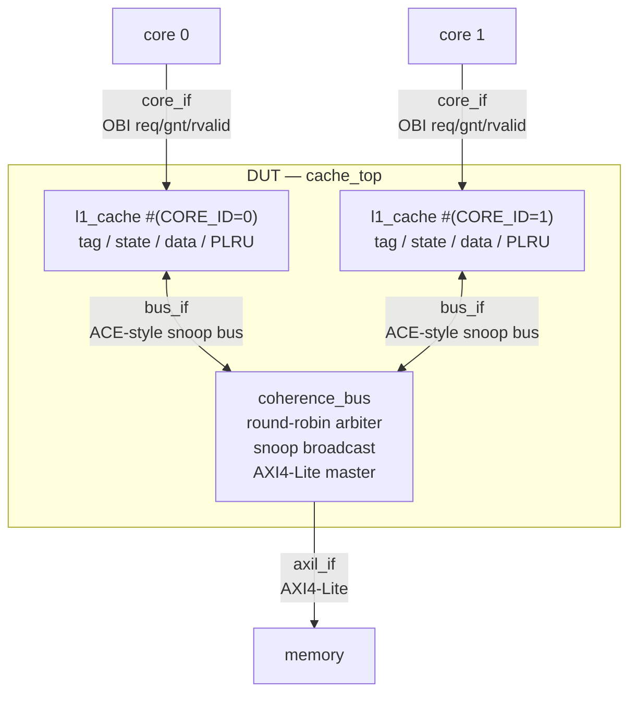
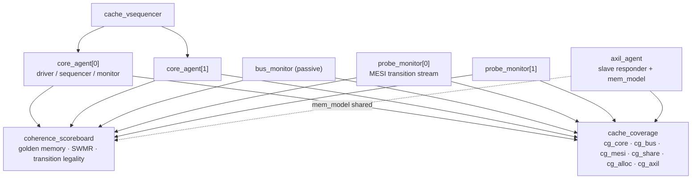

# braytcache — MESI-Coherent L1 Data Cache and UVM Verification Environment

braytcache is a two-core, set-associative, write-back L1 data cache that
maintains **MESI coherence** over a snooping interconnect. It is verified by a
constrained-random **UVM** environment that features transaction-level data
checking, coherence-invariant checking, functional coverage, and protocol
assertions.

---

### Status

**12 / 12 tests pass** &nbsp;·&nbsp; **5 / 5 injected bugs detected** &nbsp;·&nbsp;
**2 / 2 geometries** &nbsp;·&nbsp; **98.92 %** functional coverage (best single
run)

| | |
|---|---|
| **RTL** | Two MESI L1 caches, snooping interconnect, AXI4-Lite memory. 8 files. |
| **Verification** | UVM: 4 agents, 6 covergroups, 6 independent checking mechanisms, 12 tests, 3 SVA modules. 29 files. |
| **Toolchain** | Questa Altera FPGA Starter Edition 2025.2 for compilation and elaboration; Synopsys VCS on EDA Playground for simulation. |
| **Evidence** | [Results](#results) · [Run screenshots](docs/RUN_SCREENSHOTS.md) · [What the runs revealed](#what-the-runs-revealed) · [Bug injection](#bug-injection) · [Debug log](docs/DEBUG_LOG.md) |

---

## Project motivation

I wanted to use this project to exercise my RTL design and verification skills that I had developed over the course of my most recent internship. After deliberating on a project to demonstrate these skills, I chose to develop a two-core L1 data cache with MESI cache coherence. This design offered interesting interactions between independent components, shared state, ownership, data movement, and timing, while remaining plausible to execute. 

The verification methodology I was most interested in exploring was
**constrained-random verification (CRV)**. Rather than relying solely on
directed tests, I wanted to build an environment that could generate varied
traffic, compare results against reference models, collect functional coverage,
and incorporate protocol rule checks with assertions.

Random traffic provides a realistic range of interactions that would more closely simulate 
how the design works in real operation. To make CRV meaningful, we also introduce
targeted constraints can increase pressure on specific behaviors such as
ownership transfers, sharing, false sharing, evictions, writebacks, and
replacement. The scoreboard and coverage model then provide feedback about both
correctness and which parts of the design the stimulus actually exercised.

This project is my attempt to develop those design and verification skills in a
way I find technically interesting. The cache implementation is
intentionally focused enough to remain manageable, while the verification
environment is designed to demonstrate the CRV workflow: constrained stimulus,
transaction monitoring, reference-model checking, functional coverage,
assertions, and failure diagnosis.

---

## Table of contents

- [Project motivation](#project-motivation)
- [Architecture](#architecture)
- [Design decisions](#design-decisions)
- [The cache](#the-cache)
- [Coherence protocol](#coherence-protocol)
- [Interfaces](#interfaces)
- [Verification environment](#verification-environment)
- [What gets checked](#what-gets-checked)
- [Functional coverage](#functional-coverage)
- [Assertions](#assertions)
- [Stimulus](#stimulus)
  - [Tests — what each one is for](#tests-veriftestscache_testssv)
- [Bug injection](#bug-injection)
- [Running it](#running-it)
- [Results](#results)
- [What the runs revealed](#what-the-runs-revealed)
- [Scope decisions and limitations](#scope-decisions-and-limitations)
- [Future extensions](#future-extensions)
- [Repository layout](#repository-layout)

---

## Architecture



There are three protocol boundaries and three different protocols for each:

| Boundary | Protocol | Purpose and rationale |
|---|---|---|
| core ↔ L1 | OBI-style `req`/`gnt`/`rvalid` | Provides a simple request/accept/response interface for single-word accesses. req and gnt establish the request and acceptance phase, while rvalid indicates completion and returned data, matching the blocking, one-outstanding-request behavior of the L1. |
| L1 ↔ L1 | Simplified ACE-inspired bus | Provides the transaction semantics required for MESI coherence, including shared and unique reads, ownership upgrades, writebacks, snoop responses, and cache-line data forwarding. The bus also carries IsShared and PassDirty information needed to determine the requester's resulting MESI state and the source of the most recent line data. |
| Interconnect ↔ memory | AXI4-Lite | Provides a standard memory-side interface using independent read-address/read-data and write-address/write-data/write-response channels. Cache-line fills and writebacks are decomposed into LINE_WORDS single-beat transactions, with AXI4-Lite providing the handshake, response, and backpressure semantics for each transfer. |

Protocol choice and design is justified in [Design decisions](#design-decisions) below.

---

## Design decisions

All design decisions made and their rationale during bring up of this project are discussed here.

Note: decisions are marked in repo with a `DECISION:` comment, so
`grep -rn "DECISION:" rtl/ verif/` allows you to locate where these decisions live. 

### Interfaces

#### Core-Cache Interface: OBI-Style req/gnt/rvalid.
Open-source cores such as Ibsex (lowRISC) and VC32E40P (OpenHW Group) use a request/grand handshake for the adddress phase, followed by an rvalid response phase. This interface is therefore a closer representation of a conventional core-to-cache boundary while remaining appropriately scoped for this project. Introducing AXI at this interface would add five independent channels, transaction IDs, and burst-handling logic to a boundary that issues a single aligned word per request. This would substantially increase the complexity of the verification agent without providing additional function coverage relevant to the cache itself. 
*Trade-off:* the core agent is custom, so it is not reusable outside this
project.

#### Coherence Interface: Simplified ACE-Inspired Protocol.
AXI4-Lite is not suitable as the coherence interface because it provides no
mechanism for snoop requests, snoop responses, cache-line state, or
cache-to-cache data transfer. It is a single-beat point-to-point read/write
protocol and does not define the transaction semantics required for MESI
coherence.

Within the AMBA family, ACE (AXI Coherency Extensions) adds dedicated
coherence channels and transaction semantics for communicating snoop requests,
responses, and data. This project uses ACE terminology where it
helps make the coherence operations explicit: ReadShared, ReadUnique,
CleanUnique, and WriteBack, along with the IsShared and PassDirty
response attributes.

The implementation is intentionally simplified for scope purposes. Rather than reproducing
ACE's independent channels, ordering rules, barriers, and Distributed Virtual
Memory (DVM) transactions, the design uses a single atomic shared bus that
holds ownership for the duration of a coherence transaction.
*Trade-off:* this is **ACE-inspired, not ACE-compliant**, implementing full ACE is a [Future extension](Future-extensions).

#### Memory Interface: AXI4-Lite.
The memory-side interface uses standard AXI4-Lite because the boundary does
not require coherence semantics. A cache-line fill or writeback consists of
ordinary address, data, and response transactions, making AXI4-Lite a natural
fit for the memory interface.

Using the standard protocol also provides a well-defined interface for the
verification environment, including independent channel handshaking,
response checking, randomized latency, and backpressure.

Trade-off: AXI4-Lite does not support bursts, so each cache-line transfer
is decomposed into LINE_WORDS independent single-beat transactions. A full
AXI4 implementation could transfer an entire line using a burst, but would
also introduce burst-length, LAST, ID, and outstanding-transaction handling. 
This is potentially a future extension, but is not included in that section.

### Microarchitecture 

#### The atomic bus eliminates MESI transient states.
The bus grant is held across snooping, memory access, and response, ensuring that no cache is snooped while another transaction is in progress. As a result, every cache line remains in one of the four stable MESI states at each clock edge. See [Why the bus is atomic](#scope-decisions-and-limitations).

Trade-off: A split-transaction bus is the natural next step toward a more realistic implementation that would require explicit transient states (IM_AD, SM_AD, …), where much of the complexity of a full MESI implementation resides.

#### The cache is blocking, with a single outstanding miss.
The cache permits only one outstanding miss at a time. This avoids the additional complexity of MSHRs, hit-under-miss handling, and memory-level parallelism, keeping the implementation focused on coherence correctness. It also simplifies the verification model: a completing access always retires before the subsequent ownership transfer.

Trade-off: The design does not exploit memory-level parallelism and therefore does not target high-performance cache behavior. Performance is secondary to coherence correctness in this implementation and was therefore scoped out. 

#### Invalid ways are preferred before PLRU victim selection. 
Allocation first uses an invalid way to avoid an unnecessary eviction. When all ways are valid, the PLRU-selected victim is used ties are resolved by lowest index to keep allocation deterministic and failures reproducible across simulation seeds.

Trade-off: This policy biases the order in which ways are populated, so cg_alloc distinguishes free-way allocation from PLRU-driven replacement to ensure both paths are exercised.

**The bus operation is re-derived every cycle rather than latched at request
time.**
This is the only genuine race an atomic bus does not remove, and it is handled
in the RTL rather than omitted. Details in
[The one race an atomic bus does not remove](#the-one-race-an-atomic-bus-does-not-remove).

#### Clean eviction is silent by design.
Dropping an S or E line without notifying other caches is legal under MESI. Consequently, a cache may retain S state even when it is the only remaining holder of the line. The implementation deliberately preserves this conservative, potentially imprecise state rather than introducing unnecessary eviction traffic, and the reference model therefore does not assume that S precisely identifies the set of current sharers.

---

### Configuration and parameterisation

#### Geometry is a verification dimension, not a fixed constant.

`NUM_WAYS`, `NUM_SETS`, `LINE_BYTES` and `NUM_CORES` are configurable for
three primary reasons:

1. It exposes hard-coded assumptions. The same verification environment must operate correctly with both 2-way and 4-way configurations. Any RTL or checker logic that implicitly assumes two ways is exposed when the 4-way configuration is exercised.
2. It validates the PLRU implementation. At NUM_WAYS=2, tree-PLRU degenerates to a single-bit replacement policy equivalent to LRU. At four ways, the implementation requires the full two-level tree with three state bits per set, providing meaningful verification of the PLRU logic.
3. It improves verification throughput. The default 512-byte cache capacity is intentionally small for a realistic processor cache. With randomized accesses over a 4 KB region, the configuration produces frequent conflict misses, evictions, and writebacks, increasing the rate at which coherence and replacement behavior are exercised.

#### Both 2-way and 4-way geometries are exercised. 
`eviction_test` passes with a 4-way, 8-set configuration without RTL or verification-source changes. This validates that the parameterised replacement logic and verification environment operate correctly beyond the default 2-way configuration. At four ways, tree-PLRU requires a two-level decision structure with three state bits per set, providing meaningful coverage of the full replacement implementation rather than the single-bit case encountered at two ways.

The configuration change also produces the expected reduction in conflict-driven writebacks: the measured count decreases from 14 to 3. The higher associativity allows the working set to occupy more ways within each set, reducing the evictions that occur under the 2-way configuration. This provides an additional sanity check that the replacement policy and cache geometry interact as expected.

#### Configuration is controlled by `+define+`, not module parameters.
Cache geometry is defined inside a SystemVerilog `package` where address-field widths, `tag_t`, `index_t`, `line_t`, and associated helper functions depend on the selected configuration. Because SystemVerilog packages cannot be parameterised, the geometry must be established at compile time. The UVM environment imports the same package and therefore requires identical configuration values. Build-time +define+ overrides with `` `ifndef `` defaults provide a consistent configuration mechanism across the RTL and verification environment.

Trade-off: changing the cache geometry requires recompilation, so geometry cannot be randomised within a single simulation build. Instead, each geometry is treated as a separate regression configuration.

### Verification architecture

#### The environment intentionally uses white-box observability.
The Single-Writer/Multiple-Reader (SWMR) invariant is a property of cache-line state rather than transaction behavior, so it cannot be verified solely from the core-facing interfaces. A black-box testbench may detect a coherence violation only after it propagates into a visible data mismatch, potentially many cycles after the original state error occurred. The verification environment therefore exposes the internal tag and MESI state arrays through a dedicated probe interface. This allows illegal coherence states to be detected at the point they occur rather than only through their downstream effects.

Trade-off: the verification environment depends on selected RTL-internal signal names. This coupling is localized to a single interface and generate block in verif/tb/tb_top.sv, this attempts to limit the impact of RTL hierarchy or signal-name changes.

#### Probe connectivity uses hierarchical assignments rather than `bind`. 
The probe interface is connected to the cache internals using hierarchical assignments. Although bind is generally the more idiomatic mechanism for attaching verification logic to RTL, hierarchical references provided more predictable behavior across the simulators targeted by this project.

`bind` is still used for the assertion modules, where simulator support is well established and the mechanism naturally matches the intended use.

Trade-off: hierarchical connectivity introduces a tighter dependency on the RTL hierarchy, but the implementation is isolated and can be replaced with `bind` if tool support permits.

#### Unwritten memory locations have deterministic initial values.
`mem_model::backing_value()` derives a deterministic value from each address and is used consistently by both the AXI4-Lite memory model and the scoreboard's golden memory. As a result, a load from an address that has not previously been written still has a well-defined expected value. This eliminates unknown-value behavior on initial reads without requiring explicit memory pre-initialization or restricting stimulus to a pre-populated address range.

#### Functional coverage is reported directly by the testbench.
The target simulation flow does not provide a persistent coverage database suitable for merging results across runs. The UVM environment reports functional coverage directly from final_phase using get_inst_coverage(). This keeps coverage reporting independent of simulator-specific database tooling and ensures that every simulation produces an immediately visible coverage summary.

Trade-off: coverage is reported independently for each simulation and is not accumulated across regression runs. Reported percentages only represent single-run coverage rather than merged regression coverage (which is also a tooling constraint).

#### Forbidden protocol states are encoded as `illegal bins`.
Coverage bins representing protocol-valid behavior and measure whether the corresponding scenario has been exercised. Protocol-forbidden behavior is modeled differently: the eight invalid two-cache MESI state combinations are encoded as `illegal_bins`. Reaching one of these combinations produces an immediate simulation error rather than merely affecting the coverage percentage. This allows the functional coverage model to serve both as a measurement mechanism and as an additional coherence checker.

#### RTL defects can be injected through compile-time `+define+`.
Five deliberate, single-point RTL mutations are controlled through +define+ options. Each mutation represents a specific defect class and is expected to cause the associated verification run to fail. These fault-injection experiments provide direct evidence that the verification mechanisms are capable of detecting the classes of errors they are intended to monitor, rather than relying solely on successful clean regressions as evidence of checker effectiveness.

---

## The cache 

| Parameter | Default | Override |
|---|---|---|
| `NUM_CORES` | 2 | `+define+CFG_NUM_CORES=n` |
| `NUM_SETS` | 16 | `+define+CFG_NUM_SETS=n` |
| `NUM_WAYS` | 2 | `+define+CFG_NUM_WAYS=n` (power of two) |
| `LINE_BYTES` | 16 (4 words) | `+define+CFG_LINE_BYTES=n` |

512 bytes per cache by default. Reasoning in [Design decisions](#configuration-and-parameterisation).

**Policy:** write-back, write-allocate, blocking (one outstanding miss).

**Replacement:** parameterised **tree-PLRU**, `NUM_WAYS-1` bits per set. Invalid
ways are preferred over the PLRU choice, lowest index first so victim selection
stays deterministic across seeds.

**Control FSM:**

```
IDLE ──req&gnt──► LOOKUP ──┬── hit, load                 ──► RESP
                           ├── hit, store, M/E           ──► RESP   (silent E→M)
                           ├── hit, store, S             ──► BUS    (CleanUnique)
                           └── miss                      ──► WB ──► BUS ──► RESP
```

`WB` issues a `WriteBack` only if the selected victim is still `M`; a snoop may
have downgraded it in the meantime, in which case the state is re-evaluated and
the writeback is skipped.

---

## Coherence protocol

### Local requests

| State | Load | Store |
|---|---|---|
| **I** | `ReadShared` → **S** if `IsShared`, else **E** | `ReadUnique` → **M** |
| **S** | hit, stays **S** | `CleanUnique` → **M** (no data moves) |
| **E** | hit, stays **E** | silent → **M**, no bus transaction |
| **M** | hit, stays **M** | hit, stays **M** |

### Snoop responses

| State | `ReadShared` | `ReadUnique` | `CleanUnique` |
|---|---|---|---|
| **I** | miss | miss | miss |
| **S** | hit, `IsShared`, stays **S** | hit → **I** | hit → **I** |
| **E** | hit, `IsShared` → **S** | hit → **I** | cannot occur (SWMR) |
| **M** | hit, `IsShared`, `PassDirty` → **S** | hit, `PassDirty` → **I** | cannot occur (SWMR) |

A `CleanUnique` is only ever issued by a cache already holding the line in **S**.
By SWMR no other cache can then hold it **E** or **M**, so those table entries
are unreachable (which is why the RTL re-derives its bus operation at grant
time, see below).

### Eviction

| Victim state | Action |
|---|---|
| **I** | free way, no bus traffic |
| **S** / **E** | silent drop, no bus traffic |
| **M** | `WriteBack` to memory, then **I** |

Silent clean eviction means another cache can sit in **S** believing the line is shared when it is in fact
the only holder. The protocol is conservative rather than precise, and the
reference model must not assume otherwise.

### Where dirty data goes

MESI must maintain a single source of responsibility for the most recent value of each cache line. Its defining constraint is that only a cache in the M state may hold data that differs from memory. The handling of dirty data during coherence transactions follows directly from this constraint.

The S state represents clean, shared data; therefore, a line cannot remain dirty once it becomes shared. When an M-state line is observed by another cache, the modified data must either be committed to memory or transferred to a new exclusive owner.

   - ReadShared hitting M → the snooping cache supplies the modified line to the requester, while the interconnect simultaneously writes the data back to memory. Both caches transition to S, leaving memory up to date.
   - ReadUnique hitting M → the snooping cache transfers the modified line directly to the requester and transitions to I. The requester becomes M. Memory remains stale, which is valid because responsibility for the most recent copy has simply transferred to the new M-state cache.

This is the key distinction between MESI and MOESI. MOESI adds the O (Owned) state, which permits a cache to retain responsibility for dirty data while allowing other caches to hold shared copies. The owner can therefore defer the memory writeback until eviction. MESI has no equivalent state, so a ReadShared intervention on an M-state line requires the modified data to be written back to memory immediately.

The cost of this design choice is observable in the verification results: cg_axil can reach 100% on tests with WriteBack=0 because an M-state intervention can generate AXI4-Lite write traffic even when no cache line is evicted.

### Why the bus is atomic

The interconnect grants ownership to one master at a time and retains that grant through the snoop, memory-access, and response phases of the coherence transaction. **A cache is therefore never snooped while it holds the bus grant**, ensuring that each cache line remains in one of the four stable MESI states at every clock edge.

The primary consequence is the elimination of transient coherence states. A conventional MESI state diagram assumes that state transitions occur instantaneously, but a split-transaction implementation introduces an interval between requesting a transaction and receiving its result.
`
For example, a cache in I that issues `ReadUnique` to satisfy a store has committed to acquiring the line but has not yet received it. During this interval, the cache is neither fully in I nor M. If another cache issues a snoop during this window, the requester must respond according to a state that represents an incomplete transaction.

Realistic MESI implementations address this by introducing transient states that encode both the stable state being exited and the transaction currently in progress. For example, IM_AD represents a transition from I toward M while awaiting the address and data phases. Each transient state introduces additional cases that must be handled by both the RTL and the verification environment.

Holding the bus grant across the complete coherence transaction eliminates this intermediate window. A cache can only be snooped when it is not participating in an active transaction, allowing the implementation to operate entirely on the four stable MESI states. The resulting snoop-response logic therefore remains a compact 4×3 state/op table rather than requiring additional transient-state cases.

**This is an intentional scope decision rather than an omission**. Transient-state handling represents a substantial portion of the complexity in a realistic MESI implementation, and this project deliberately isolates the stable-state coherence behavior. A natural next step would be a split-transaction interconnect with explicit transient states, which would substantially increase both RTL and verification complexity. See [Future extensions](#future-extensions).

### The one race an atomic bus does not remove
Atomic bus ownership eliminates races during an active coherence transaction, but it does not prevent a cache from being snooped while it is waiting for arbitration. Consider the following sequence:

> Cache 0 holds line X in **S** and requests the bus for `CleanUnique`.
> Cache 1 wins arbitration first and issues `ReadUnique` on X, invalidating cache 0.
> Cache 0's pending upgrade is now stale because it no longer holds the line.

The RTL handles this case by deriving `bus.op` **combinationally from the current cache state on every cycle** 
rather than latching the operation when the request is first generated. A pending `CleanUnique` therefore becomes a `ReadUnique`
if the cache is invalidated before arbitration completes. Similarly, a pending `WriteBack` is withdrawn if a snoop downgrades the victim before the writeback is granted. 

This also means `bus.req` may **deassert** before receiving a grant. That behavior is legal for the implemented bus protocol and is verified by `a_bus_progress`, which requires a request to either receive a grant or retire without becoming permanently outstanding.

Measured validation. `upgrade_race_test` drives both caches into S and then issues simultaneous stores to the same line. The test randomizes the number of rounds between 4 and 8 and the reported seed executed six rounds. Each round operates on a consecutive line, preventing conflicts between rounds.

```
ReadShared=12  ReadUnique=6  CleanUnique=6  WriteBack=0
state transitions=42
```

Six rounds produced **six `CleanUnique` and six `ReadUnique`**, which is expected of the 1:1 relationship
between the winning and losing upgrade attempts. In every round, one cache completed its `S->M` upgrade while the losing
cache was invalidated before its pending `CleanUnique` could be granted. That stale request was subsequently re-derived 
as `ReadUnique`, exercising hte intended race-resolution path on every round without data loss. 

The measured state-transition count provides an independent consistency check. Each round produces:

`I→E` → `E→S` + `I→S` → `S→M` + `S→I` → `M→I` + `I→M`

This corresponds to seven state transitions per round. Across six rounds:

**7 transitions × 6 rounds = 42 transitions**

which matches the count reported by the scoreboard.

---

## Interfaces

| File | Interface | Notes |
|---|---|---|
| [rtl/core_if.sv](rtl/core_if.sv) | `core_if` | OBI-style core interface with dedicated clocking blocks for the driver and monitor. |
| [rtl/bus_if.sv](rtl/bus_if.sv) | `bus_if` | Per-master signals are implemented as **unpacked arrays**, allowing each cache to drive only its corresponding element. Modports are intentionally omitted to avoid false multi-driver errors on the shared interface. |
| [rtl/axil_if.sv](rtl/axil_if.sv) | `axil_if` | Full AXI4-Lite interface spanning all five channels. |
| [rtl/cache_probe_if.sv](rtl/cache_probe_if.sv) | `cache_probe_if` | White-box verification interface driven through hierarchical assignments from [verif/tb/tb_top.sv](verif/tb/tb_top.sv). |


---

## Verification environment



| Component | Role |
|---|---|
| [core_agent](verif/agents/core_agent/core_agent.sv) | Active OBI master, instantiated once per core. The monitor correlates the address and response phases and emits a completed transaction. |
| [axil_agent](verif/agents/axil_agent/axil_agent.sv) | AXI4-Lite **slave responder** backed by [mem_model](verif/agents/axil_agent/mem_model.sv), with randomized per-channel latency. The monitor feeds coverage, while the scoreboard accesses the shared memory model directly at end of test. |
| [bus_monitor](verif/agents/bus_agent/bus_monitor.sv) | Passive monitor that reconstructs each coherence transaction, including the operation, requester, snoop hits, `PassDirty`, `IsShared`, and line data. |
| [probe_monitor](verif/agents/probe_agent/probe_monitor.sv) | White-box monitor that emits one item for each observed cache-line state transition, producing a direct MESI transition stream. |
| [coherence_scoreboard](verif/env/coherence_scoreboard.sv) | Centralized checking component responsible for coherence validation, golden-memory comparison, SWMR invariant checking, and MESI transition legality. |
| [cache_coverage](verif/env/cache_coverage.sv) | Centralized functional coverage model covering core, bus, MESI, sharing, allocation, and AXI4-Lite behavior, with a self-reported coverage summary. |

---

## Verification strategy

## Verification Strategy

The environment uses **six complementary checking mechanisms**, each targeting a distinct class of correctness. The checks are intentionally independent so that no single mechanism is responsible for detecting every failure mode.

### 1. Data-Value Invariant (Golden Memory)

Every store observed at a core interface updates a reference memory; every load is checked against the expected value. Ordering follows **monitor completion time**.

Coherence serializes same-address accesses: a core may write only while holding **M**, and ownership transfers require multiple cycles. Therefore, an access must complete before a subsequent ownership transfer can retire. Two same-address accesses completing in the same cycle would itself violate the SWMR invariant and are caught by the dedicated SWMR checker.

### 2. MESI Transition Legality

Every state transition observed on the probe stream is checked against a **MESI legality table**.

Tag changes are treated as allocations and are permitted only when the previous occupant is clean. This catches cases where a modified line is silently evicted without first being written back, preventing the resulting data loss from propagating unnoticed through the simulation.

### 3. SWMR Invariant

**Single-Writer / Multiple-Reader (SWMR)** is the fundamental safety invariant of the coherence protocol:

> For any cache line at any moment, either exactly one cache may write the line while no other cache holds a copy, or multiple caches may hold copies while none may write.

The MESI states encode these cases directly:

* **M / E:** single-writer ownership
* **S:** multiple-reader ownership
* **I:** no ownership

The checker maintains a per-line census across both caches and re-evaluates it whenever a line changes state. It enforces that:

* At most one cache holds **M** or **E** for a line.
* An **M/E** holder never coexists with **S** sharers.

SWMR is a **state invariant**, not a transaction property. Core-interface transactions alone cannot establish that the caches are simultaneously maintaining legal ownership, which is why the environment exposes internal MESI state through a dedicated whitebox probe. The check is triggered by state transitions rather than evaluated every cycle: a coherence state can become illegal only when it changes.

### 4. Sharer Data Agreement

All caches holding a line in **S** must contain identical data.

This check complements the SWMR invariant by verifying not only that shared ownership is legal, but that every sharer actually observes the same value.

### 5. Bus-Level Consistency

The coherence bus is checked independently from cache state:

* `IsShared` must agree with the observed snoop hits.
* An upgrade transaction must not transfer or modify data.

These checks isolate errors in the interconnect's aggregation and transaction-classification logic from errors originating inside the caches.

### 6. End-of-Test Memory Reconciliation

At the end of each test, every word touched during the run is reconciled against the **actual final system state**.

If a cache still holds the corresponding line in **M**, the dirty cached value is treated as authoritative; otherwise, the AXI4-Lite memory value is compared against the expected reference-memory value.

This serves as the final backstop for **silent dirty-data loss**, catching cases where a modified line disappears without a corresponding writeback even if no earlier transaction-level check exposed the failure.


---

## Functional coverage 

Functional coverage is organized around six covergroups, each targeting a distinct dimension of cache, coherence, allocation, or interface behaviour.

| Covergroup | Covers |
|---|---|
| `cg_core` | op × core × set index × word offset × byte-enable pattern (full word, single byte, partial) |
| `cg_bus` | coherent op × requester × snoop hit × `PassDirty` × `IsShared`; includes dirty intervention, where a snooper supplies data instead of memory |
| `cg_mesi` | old state × new state × tag-changed, per core |
| `cg_share` | **cache 0 state × cache 1 state for one line** |
| `cg_alloc` | victim state at allocation × way × set × core; verifies both free-way and PLRU-driven victim selection and exercises every way |
| `cg_axil` | AXI4-Lite direction × word position within the line; verifies every beat of a line is both fetched and written back |

### The illegal bins

The `cg_mesi` and `cg_share` covergroups encode protocol violations as `illegal_bins`, turning forbidden states and transitions into simulation errors rather than merely uncovered coverage points.

```systemverilog
// cg_share — every state pair MESI forbids
illegal_bins mm = binsof(cp_c0) intersect {MESI_M} && binsof(cp_c1) intersect {MESI_M};
illegal_bins ms = binsof(cp_c0) intersect {MESI_M} && binsof(cp_c1) intersect {MESI_S};
illegal_bins ee = binsof(cp_c0) intersect {MESI_E} && binsof(cp_c1) intersect {MESI_E};
// ...

// cg_mesi — allocating over a modified way is dropped dirty data
illegal_bins dirty_dropped = binsof(cp_old)  intersect {MESI_M} &&
                             binsof(cp_tagc) intersect {1};
```

#### Deriving the Shareability Cross

The `cg_share` cross contains two caches and four MESI states, producing:

`4 x 4 = 16` ordered state pairs.

A pair is legal if and only if it does not place two writers, or a writer alongside a reader, on the same cache line. 

| | c1 = **I** | c1 = **S** | c1 = **E** | c1 = **M** |
|---|---|---|---|---|
| **c0 = I** | legal | legal | legal | legal |
| **c0 = S** | legal | legal | illegal `se` | illegal `sm` |
| **c0 = E** | legal | illegal `es` | illegal `ee` | illegal `em` |
| **c0 = M** | legal | illegal `ms` | illegal `me` | illegal `mm` |

This produces **8 legal and 8 illegal combinations**. The eight illegal combinations are encoded directly as `illegal_bins` in the source and named <c0><c1>.

The I row and column are legal throughout because an invalid cache holds no copy of the line and therefore imposes no ownership constraint.

The cross is over **ordered pairs**, so `se` and `es` are distinct bins even though they represent the same physical class of violation. Keeping both bins preserves which cache held the conflicting exclusive state in a coverage or failure report.

#### Unreachable Bins

Unreachable combinations are excluded with ignore_bins, including:

  - Same MESI state with no tag change where a transition cannot occur.
  - Allocations that produce an invalid line.

This keeps the coverage model focused on reachable architectural behavior and makes 100% coverage an achievable.

### Coverage reporting 

There is no persistent simulator coverage database in the default flow. Instead, [cache_coverage.sv](verif/env/cache_coverage.sv) reports coverage directly during `final_phase` using `get_inst_coverage()` and `$get_coverage()`:

```
UVM_INFO ... [COV] ---------------- functional coverage ----------------
UVM_INFO ... [COV]   cg_core    ..... %
UVM_INFO ... [COV]   cg_bus     ..... %
UVM_INFO ... [COV]   cg_mesi    ..... %
UVM_INFO ... [COV]   cg_alloc   ..... %
UVM_INFO ... [COV]   cg_axil    ..... %
UVM_INFO ... [COV]   cg_share   ..... %
UVM_INFO ... [COV]   OVERALL    ..... %
```

This approach is simulator-independent and remains usable in environments that cannot generate or merge coverage databases.

**Coverage is reported per simulation, not accumulated across the regression.** 

Each test launches a fresh `simv`, constructs a new set of covergroups, and writes no coverage database to disk. Consequently, `get_inst_coverage()` reports only the bins sampled during that simulation.

Different tests intentionally target different regions of the coverage space. For example, the directed MESI walk closes transitions that random traffic may not encounter, while eviction_vseq targets victim states and replacement behaviour that other tests may rarely reach.

A regression-wide coverage number therefore requires database collection and merging, such as a VCS coverage flow using `-cm` followed by `urg`. Persistent regression coverage is listed as a [future extension](#future-extensions) of the project.

---

## Assertions

Three SVA modules verify protocol properties independently of the UVM scoreboards and functional coverage. 

| File | Scope | Representative properties |
|---|---|---|
| [verif/sva/cache_sva.sv](verif/sva/cache_sva.sv) | `bind` into every `l1_cache` | OBI request and payload stability; exactly one response per accepted request; `a_grant_excludes_snoop`; `a_op_frozen_while_granted`; bus progress |
| [verif/sva/bus_sva.sv](verif/sva/bus_sva.sv) | Coherence interconnect | One-hot-or-zero grants and responses; ownership transfer requires an idle cycle; snoops never target the current owner; `a_single_pass_dirty` |
| [verif/sva/axil_sva.sv](verif/sva/axil_sva.sv) | AXI4-Lite interface | Per-channel valid and payload stability until ready; `OKAY` responses; address alignment; no `B` without preceding `AW` and `W`; no `R` without `AR` |

The cache-level assertions are attached using bind, keeping verification logic outside the RTL while instantiating the assertion module for every cache instance.

Several properties also encode assumptions used by the cache architecture itself. For example, `a_grant_excludes_snoop` guarantees that a cache holding a core-side grant cannot simultaneously receive a snoop request, supporting the design's avoidance of transient MESI states.

---

## Stimulus

The environment combines **constrained-random and directed virtual sequences**. Constrained-random sequences explore broad transaction spaces, while directed sequences establish specific interleavings or state transitions that must occur in a known order. 

### Directed vs constrained-random

Eight of the eleven virtual sequences use **constrained-random** stimulus. They differ primarily in the constraints applied to address selection, cache-set selection, and load/store distribution to increase the probability of particular coherence behaviours.

Three are **fully directed**, and they exist for reasons random stimulus cannot cover:

| Directed sequence | Why it must be directed |
|---|---|
| `mesi_walk_vseq` | Traverses every legal same-line MESI transition in a known order on an empty cache, closing transition coverage deterministically |
| `upgrade_race_vseq` | Deliberately creates the `CleanUnique` → `ReadUnique` degradation that occurs when competing upgrades overlap |
| `producer_consumer_vseq` | Implements a message-passing litmus test with a fixed ordering between producer and consumer |

The directed sequences issue operations through `do_access()`, which blocks until `rvalid`. Sequential calls therefore establish an explicit interleaving between the two cores.

### Core-level sequences 

Core-level sequences, implemented in ([verif/agents/core_agent/core_seq_lib.sv](verif/agents/core_agent/core_seq_lib.sv)), generate individual streams of OBI traffic:

| Sequence | Intent |
|---|---|
| `core_base_seq` | Random operations over a configurable address region with a configurable `store_pct` |
| `core_line_seq` | All traffic confined to one cache line, providing the primative for false sharing  |
| `core_pingpong_seq` | All traffic to one word |
| `core_set_conflict_seq` | Generates more live tags than available ways in a selected set, forcing evictions and writebacks |
| `core_store_streak_seq` | Repeated stores to one address, exercising silent `E→M` transitions and long `M` hit sequences without bus traffic |
| `core_read_only_seq` | Load only traffic that drives lines towards stable  `S` and `E` states |
| `core_single_seq` | Issues one explicit access for use by directed virtual sequences |

### Virtual sequences START HERE SEP

Virtual sequences, implemented in ([verif/env/seq_lib/cache_vseq_lib.sv](verif/env/seq_lib/cache_vseq_lib.sv)), coordinate traffic across both cores. 

The base virtual sequence launches one core-level sequence per core. Individual subclasses specialize the traffic pattern by overriding `run_core_seq()`.

| Virtual sequence | Coherence behaviour it targets |
|---|---|
| `random_vseq` | Broad random traffic |
| `shared_region_vseq` | Both cores confined to four lines — maximum coherence pressure |
| `false_sharing_vseq` | Same line, different words: invalidation storms with no real data sharing |
| `pingpong_vseq` | Same word: ownership migrates on nearly every access |
| `eviction_vseq` | Both cores thrashing the same set |
| `read_mostly_vseq` | Wide `S` sharing that stays stable |
| `store_streak_vseq` | Bursts of stores to one address, then a new one — silent `E→M`, long bus-silent `M` runs, then migration |
| `producer_consumer_vseq` | **Directed.** Message-passing litmus test (below) |
| `mesi_walk_vseq` | **Directed.** Every legal MESI transition, in order, on an empty cache |
| `upgrade_race_vseq` | **Directed.** Simultaneous stores from `S` to force an upgrade to degrade |
| `mixed_vseq` | Chains 3–6 randomly chosen phases in one seed — the regression workhorse |

### Message-passing litmus test

Core 0 writes a payload, then sets a flag **on a different cache line**. Core 1
spins on the flag and, once it observes value *k*, must see payload *k*.

Because the caches are blocking and the bus is atomic, the memory model is
sequentially consistent and the payload can never be stale. The sequence asserts
this explicitly, and the golden-memory checker would independently catch a
violation. It is a small test that makes the consistency claim concrete.

### Tests ([verif/tests/cache_tests.sv](verif/tests/cache_tests.sv))

Twelve tests. Each is a thin wrapper selecting a virtual sequence — build,
objection handling and drain are inherited from `cache_base_test` — so a test
carries no logic of its own. It is a statement about *which architectural
mechanism is being placed under stress*, and nothing more.

The organising principle is **attribution**. A cache is a small set of
interacting mechanisms: lookup, allocation, replacement, writeback, snoop
response, ownership transfer. A random workload exercises all of them at once, so
when one fails the failure is real but unattributable. Each test below constrains
stimulus until a single mechanism dominates the traffic, so that a failure
implicates that mechanism rather than the design as a whole.

#### Structural

**`smoke_test`** — fifteen random loads and stores per core, spread over the
default 4 KB region.

Not intended to find protocol bugs; intended to establish that the *measuring
apparatus* works. A coherent cache is observable only through the driver
handshake, the bus monitor, the whitebox probe and the golden memory, and all
four must be functioning before any statement about the design means anything.
Fifteen transactions is deliberately too short to construct a subtle coherence
scenario, and that is what makes it a clean test of infrastructure: what fails
here is the testbench, not the cache.

**`random_test`** — 40 to 90 random accesses per core over 4 KB, with the
load/store mix itself randomised.

Architecturally the weakest coherence test in the suite and the strongest
structural one. Addresses are spread widely, so most accesses miss in a way that
involves no other cache and coherence events are comparatively rare; but the same
spread produces many distinct tags per set, natural capacity pressure, and index
and tag decode exercised across their full range. It asks whether the addressing
and allocation machinery is right, with coherence as incidental traffic.

#### Coherence pressure

These narrow the address space until sharing becomes the dominant behaviour
rather than a rare event. Each isolates a different consequence of sharing.

**`shared_region_test`** — the same random traffic as `random_test`, but confined
to four cache lines.

The question is what happens when the *rate* of coherence events approaches the
rate of accesses. In a widely spread workload a cache spends most of its time in
the uncontended hit path; here it spends most of its time responding to snoops or
waiting for the bus. Any dependence on quiet periods between coherence events is
exposed here. A design that is correct only because snoops are rare has not been
tested.

**`false_sharing_test`** — one randomly chosen line, both cores accessing it, but
each mostly touching different words within it.

Coherence operates on lines; programs operate on words. False sharing is the case
where those two granularities disagree, and it is what separates *invalidation*
from *data loss*. When core 0 writes word 0 and core 1 writes word 1 of the same
line, correctness requires that ownership transfer carry the whole line
faithfully — including the words the requester is not writing. A design that
fills correctly but merges incorrectly is indistinguishable from a correct one
under genuine sharing, because both cores read the same word. This test exists to
make that distinction observable.

**`pingpong_test`** — one randomly chosen word, hammered by both cores, with the
mix pinned near 50/50 loads and stores.

Ownership migrates on nearly every access, which is the highest sustained rate of
state change the protocol permits. This is the *ownership transfer* test: every
mechanism involved in moving a line between caches — snoop lookup, response
encoding, dirty intervention, invalidation — runs continuously, with no idle path
in between. It is correspondingly the heaviest load the arbiter sees, since both
caches are requesting the bus almost constantly.

**`eviction_test`** — one randomly chosen set, both cores cycling through more
distinct tags than there are ways, weighted 50–90 % stores.

This is the *replacement and writeback* test, and the only one that stresses the
interaction between coherence and capacity. Everywhere else in the suite a line
leaves a cache because another cache asked for it; here a line leaves because the
cache needed the way. Those are different paths with different obligations. In
particular, a modified line evicted for capacity reasons must be written back,
and since nothing external requested it, nothing external will notice if it is
silently dropped. That is precisely why the end-of-test memory reconciliation
does real work only in this test.

**`read_mostly_test`** — loads only, no stores at all, over eight lines.

The property of interest is negative: once a set of lines has been read into **S**
by both caches, the protocol should generate no further bus traffic at all. The
test asks whether the design recognises *stable sharing* — that a shared line
requires no action on a read hit — and whether `IsShared` is derived from the
actual presence of other copies rather than assumed. A cache installing **E**
while a sharer exists violates the single-writer/multiple-reader invariant
immediately, and a read-only workload is the cleanest place to observe that,
because nothing else is happening.

**`store_streak_test`** — two to four bursts per core, each burst being repeated
stores to a single address, with a new address chosen between bursts. Confined to
four lines so the cores collide.

This targets the **M**-hit silence, where correct behaviour is the absence of an
action. A cache holding a line in **M** may modify it repeatedly with no bus
transaction at all, because no other cache can be affected. That is a performance
property rather than a correctness one, and a design that broadcasts
unnecessarily still returns correct data — which is why it is invisible to a data
checker and observable only through bus-transaction counts. The address changes
between bursts are what make periods of silence alternate with genuine ownership
acquisition.

**Measured: 90 stores produced 5 bus transactions.** One `ReadUnique` per new
address, then nothing — 85 of 90 stores were completely silent, and the run
finished in 3.4 us, the fastest in the suite.

*What this test does **not** cover.* MESI has a second silent path, the `E→M`
upgrade, and this sequence cannot reach it. Entering **E** requires a
`ReadShared` that finds no other holder, and `ReadShared` is only issued on a
*load* miss. `store_streak_test` issues no loads at all (`loads=0`,
`ReadShared=0`), so every acquisition is a `ReadUnique` straight to **M** and no
line is ever **E**. The `E→M` upgrade is covered by `mesi_walk_test`, which loads
before storing. Two silent paths, two different tests — an earlier draft of this
section claimed both were covered here, which the traffic counters disproved.

#### Directed

Three sequences abandon randomisation, each for a specific reason. All three
drive the cores through a blocking helper that does not return until `rvalid`, so
the interleaving between the two caches is fixed rather than a property of the
seed.

**`mesi_walk_test`** — ten specific accesses across three adjacent lines, chosen
so that the two caches walk every legal same-line MESI transition in a known
order, starting from an empty cache.

The purpose is *constructive* coverage: the MESI transition graph is small enough
to traverse exhaustively, so leaving that traversal to chance is a choice to be
less certain for no benefit. Its diagnostic role matters equally. Because each
access completes before the next begins, the transition sequence is a property of
the test rather than of the seed, and a failure identifies a named transition
instead of a position in a random stream.

**`producer_consumer_test`** — core 0 writes a payload to one line then a counter
to a *second* line; core 1 polls the second line and, on seeing counter value *k*,
reads the first line and requires payload *k*. Repeated four to twelve times.

The distinction being drawn is between **coherence** and **consistency**.
Coherence is a per-line property, and both lines here are independently coherent
regardless of the order in which the two writes become visible; nothing in MESI
alone forbids the flag being seen before the payload. The property under test
belongs to the memory model, and it holds in this design for a structural
reason — the caches are blocking and the bus is atomic, so no core can have two
accesses in flight and no two accesses can be reordered. The test makes that
argument checkable rather than merely asserted.

**`upgrade_race_test`** — for each of four to eight lines, taken consecutively
from the region base: both cores load it so both hold **S**, then both issue a
store to it in the same instant.

An atomic bus removes almost every race in the design by construction; this test
targets the one it does not. A cache that decides to issue `CleanUnique` while in
**S** may lose arbitration and be invalidated before it is granted, at which point
its pending request is stale — it no longer holds the line, so an upgrade would
grant write permission over data it does not have. Correct behaviour is to
re-derive the request at grant time and issue `ReadUnique` instead. The race
requires both caches to be waiting on the bus simultaneously, which cannot be
forced with certainty from the core interfaces; zero-delay stores against a bus
transaction tens of cycles long make the overlap reliable, and repetition across
lines makes it near-certain.

#### Composite

**`regression_test`** — three to six of the above sequences, chosen at random and
run back to back in a single simulation without an intervening reset.

Every other test begins from reset and therefore examines mechanisms in a cache
whose history is known. This one deliberately does not. The region of interest is
the *phase boundary*, where the tag and state arrays left by one access pattern
become the initial condition for a completely different one: a set thrashed to
full occupancy then subjected to read-only sharing, or a line held in **M**
meeting a workload that never touches it again. These are states no
single-pattern test constructs, and they are where residual-state bugs live.

---

Memory latency is randomised per test through `axil_agent_cfg`, so the timing
relationship between line fills and coherence traffic varies seed to seed rather
than being fixed by the testbench. A test that passes only at one memory latency
has not really passed.

`+num_txns=<n>` overrides sequence length on the seven tests whose stimulus is a
length-parameterised core sequence — `smoke`, `random`, `shared_region`,
`false_sharing`, `pingpong`, `eviction`, `read_mostly`. The count is **per
core**, so `+num_txns=30` on a two-core configuration issues sixty accesses.

The other five ignore it, because their length is not a transaction count: the
three directed sequences override `body()` entirely and are sized by rounds or
messages, `store_streak_vseq` is sized by `n_streaks`, and `mixed_vseq`
re-randomises a length per phase.

---

## Bug injection

Five deliberate RTL bugs sit behind `+define+BUG_n`. Every one of these runs
**must fail** — a clean run means the checkers are blind to that bug and the
environment needs work. This is the cheapest possible evidence that the
testbench actually checks something.

**All five are detected.** Results and the per-mechanism breakdown are at the
[end of this section](#all-five-side-by-side).

| Define | Injected bug | Caught by | Status | Evidence |
| --- | --- | --- | --- | --- |
| `BUG_1` | Snooped **M** line goes to **E** instead of **S** on `ReadShared` | `cg_mesi` illegal bin `m_to_e` | **DETECTED** at 1.46 us | [view](docs/screenshots/bug_1.png) |
| `BUG_2` | `CleanUnique` does not invalidate the sharer | `cg_share` illegal bin `ms` | **DETECTED** at 7.68 us | [view](docs/screenshots/bug_2.png) |
| `BUG_3` | Store hit ignores byte enables | Golden-memory load mismatch | **DETECTED** — 11 errors, exit 0 | [view](docs/screenshots/bug_3.png) |
| `BUG_4` | Dirty victim evicted without a writeback | `cg_mesi` illegal bin `dirty_dropped` | **DETECTED** at 3.67 us | [view](docs/screenshots/bug_4.png) |
| `BUG_5` | `ReadShared` always installs **E** | `cg_share` illegal bin `se` | **DETECTED** at 1.80 us | [view](docs/screenshots/bug_5.png) |

Put the define in **Compile Options** on Playground and run `eviction_test`:

| Compile Options | Run Options |
|---|---|
| `+define+BUG_2` | `+UVM_TESTNAME=eviction_test +num_txns=30` |

`eviction_test` is used for all five because it is the only test that produces
writebacks, without which `BUG_2` and `BUG_4` cannot manifest at all.

### Detection is a property of the bug *and* the stimulus

A bug-injection run that passes has two possible meanings, and they are not
equally interesting:

1. the checkers cannot see this class of defect — a real hole
2. the stimulus never created the conditions the defect needs — a test-selection
   mistake

`BUG_4` makes the distinction concrete. It disables writeback of dirty victims,
so it can only manifest when a **M** line is evicted for capacity. Under
`smoke_test` or `pingpong_test` no eviction ever occurs, so the run passes and
proves nothing whatsoever. Only `eviction_test` puts the design in a state where
the mutation has an effect.

This is measurable rather than hypothetical. The clean `smoke_test` run reported
`CleanUnique=0 WriteBack=0`, which means `BUG_2` and `BUG_4` are **provably**
undetectable under it — the mutated lines never execute. And detection latency
tracks how often the mutated path runs: on `eviction_test`, `BUG_1` sits on a
path taken 17 times and was caught at 1.46 us, while `BUG_2` sits on a path taken
twice and was caught at 7.68 us.

Each bug below therefore records the stimulus it requires, not just the checker
that should fire. Predictions are written before the run so that the comparison
afterwards means something.

### `BUG_1` — snooped **M** goes to **E** — **DETECTED**

```systemverilog
BUS_READ_SHARED:  state_q[sn_idx][sn_way] <= MESI_E;   // should be MESI_S
```

*Why it is wrong.* A cache being snooped by `ReadShared` is about to have a
second copy of the line exist. It must therefore drop to **S**. Staying in **E**
claims exclusivity that no longer holds, and if it was in **M** it also silently
discards the dirty marking.

*Required stimulus.* Another cache must issue `ReadShared` for a line this cache
holds. `eviction_test` is 50–90 % stores on a single shared set, so dirty lines
being snooped is the common case rather than a rare one.

*What we wanted to see.* The `cg_mesi` illegal bin `m_to_e`, early, naming the
transition.

*What happened.* Exactly that, at 1.455 us — inside the first 8 % of a run that
takes 18.7 us clean:

```
Error-[FCIBH] Illegal bin hit
  At time 1455000 ps, Illegal bin m_to_e of cross x_trans in covergroup
  cache_uvm_pkg::cache_coverage::cg_mesi got hit with sample values
  cp_old=MESI_M cp_new=MESI_E cp_tagc=0x0
Exit code expected: 0, received: 1
```

*Nuance worth recording.* `m_to_e` only fires when the snooped line was **M**.
Had the snooped line been **E** or **S**, the transition would have been `E→E`
(no state change, so no probe event and no sample at all) or `S→E`, and detection
would have fallen to `cg_share` and the SWMR sweep instead. The same bug is
caught by different checkers depending on the workload — which is an argument for
having both, not a redundancy to trim.

### `BUG_2` — `CleanUnique` does not invalidate the sharer — **DETECTED**

```systemverilog
BUS_CLEAN_UNIQUE: state_q[sn_idx][sn_way] <= state_q[sn_idx][sn_way];  // should be MESI_I
```

*Why it is wrong.* `CleanUnique` is the upgrade path: the requester holds **S**
and wants **M** without refetching data. Every other copy must be invalidated. If
the sharer keeps its **S** copy, the result is **M** and **S** coexisting — a
direct SWMR violation, and the sharer's copy is now stale.

*Required stimulus.* A line held **S** by both caches, then a store from one.

*What we predicted, before running it.* **Not** `cg_mesi`. The snooped cache
undergoes no state change at all, so no probe item is emitted for it and a
transition-based check has nothing to look at. Expect `cg_share`'s `ms` or `sm`
illegal bin to fire when the *requester* transitions `S→M`, aborting with exit 1.

*What happened.* Exactly that:

```
Error-[FCIBH] Illegal bin hit
  At time 7675000 ps, Illegal bin ms of cross x_pair in covergroup
  cache_uvm_pkg::cache_coverage::cg_share got hit with sample values
  cp_c0=MESI_M cp_c1=MESI_S
Exit code expected: 0, received: 1
```

The negative half of the prediction is the interesting half. `cg_mesi` is at
98.95 % on this stimulus and saw nothing, because **there is no transition to
see** — the sharer's state is unchanged and the probe monitor only emits on
change. Detection required reading *both* caches at one instant, which is what
`cg_share` does through `state_of()` at every probe event. A per-cache view of a
coherence protocol is structurally insufficient, and this is the run that shows
it rather than arguing it.

*Detection latency is 5× that of `BUG_1`,* and the reason is worth stating. On
the clean run `eviction_test` produced `ReadShared=17` but `CleanUnique=2`. The
mutated path executes twice in the entire test, so the bug has to wait for one of
those two events. `BUG_1` sits on a path taken seventeen times and was caught at
1.46 us; `BUG_2` sits on a path taken twice and was caught at 7.68 us.

The corollary is a hazard: `smoke_test` reported `CleanUnique=0` on its clean
run, so `BUG_2` is **provably undetectable** under that test. Not a checker
weakness — the stimulus simply never executes the mutated line.

### `BUG_3` — store hit ignores byte enables — **DETECTED**

```systemverilog
data_q[rq_idx][hit_way] <= line_set_word(..., rq_wdata_q, '1);   // should be rq_be_q
```

*Why it is wrong.* A partial-word store overwrites the bytes it was not asked to
write. This is a pure data-path defect.

*Required stimulus.* A store with `be != '1`, followed by an observation of the
clobbered bytes — either a later load of that word, or the line reaching memory
so end-of-test reconciliation sees it.

*What we predicted, before running it.* Every MESI state, transition and
cross-cache pair remains legal, so no illegal bin can fire and no assertion can
fail. Detection must come from the golden memory alone, and the run should look
entirely unlike `BUG_1`: `UVM_ERROR`s from the scoreboard, simulation to
completion, a full coverage table, and **exit code 0**.

*What happened.* All of it, and one thing stronger than predicted.

```
UVM_ERROR [SB_DATA]  load mismatch: c0 LD addr=0x0000022c rdata=0x1d4972af expected=0x9d4972af
UVM_ERROR [SB_FINAL] addr 0x00000024 expected=0xa7671c07 actual=0xa7676b07
...
UVM_ERROR :   11        [SB_DATA] 5     [SB_FINAL] 6
$finish at simulation time  18655000
```

**The coverage table is byte-identical to the clean run.** Same 94.53 % overall,
same figure in all six groups, same `$finish` time, same scoreboard traffic
counters — `loads=28 stores=32`, `ReadShared=17 ReadUnique=19 CleanUnique=2
WriteBack=14`, 68 transitions. The control path is bit-for-bit unchanged; only
the data differs.

That is the most useful result in this set. **A functional coverage score of
100 % would not have found this bug**, because the bug does not change what the
design *does*, only what it *stores*. Coverage closure and correctness are
different claims, and this run is the concrete demonstration rather than the
usual assertion of it.

*Three further details worth reading off the log.*

**The mismatch pattern identifies the bug class.** `0x1d4972af` against
`0x9d4972af` differs in one byte; `0x422cb824` against `0xaed77d24` agrees only
on the low byte. The disagreements are byte-granular and the *agreeing* bytes are
exactly the ones the store had enabled. A control-path bug would have corrupted
whole words or returned the wrong line entirely.

**Both cores observe the same wrong value.** Address `0x328` mismatched on core 1
at 11.46 us and on core 0 at 13.66 us with identical data. Coherence is working
perfectly — it is faithfully propagating corruption. Coherence guarantees that
all cores agree on a line's contents, not that those contents are right.

**End-of-test reconciliation earned its place.** Of the six `SB_FINAL`
mismatches, four are at addresses no load ever touched. Without that check those
four corruptions would have gone unreported, since nothing in the test ever read
them back.

### `BUG_4` — dirty victim evicted without a writeback — **DETECTED**

```systemverilog
assign wb_needed = 1'b0;   // should be (state_q[rq_idx][vic_q] == MESI_M)
```

*Why it is wrong.* The cache skips `ST_WB` entirely and overwrites the victim way
in place, so a modified line is destroyed without its data ever reaching memory.

*Required stimulus.* A capacity eviction of a line in **M**. `eviction_test` is
the only test that reliably produces one — it reported `WriteBack=14` on the
clean run.

*What we predicted.* Two independent detectors, and it was worth knowing which
would win. The victim way goes from **M** straight to the new line's tag and
state, so the probe emits an event with `old_state = MESI_M` and
`tag_changed = 1`. That should trip `cg_alloc`'s `illegal_bins dirty` and
`cg_mesi`'s `dirty_dropped`. Failing both, end-of-test reconciliation should
report the lost line.

*What happened.* `cg_mesi` fired at 3.665 us:

```
Error-[FCIBH] Illegal bin hit
  At time 3665000 ps, Illegal bin dirty_dropped of cross x_trans in covergroup
  cache_uvm_pkg::cache_coverage::cg_mesi got hit with sample values
  cp_old=MESI_M cp_new=MESI_M cp_tagc=0x1
Exit code expected: 0, received: 1
```

`cp_old=M`, `cp_new=M`, `cp_tagc=1` reads as: this way held a modified line, now
holds a *different* modified line, and no writeback occurred in between. Note
that `dirty_dropped` is defined on `cp_old` and `cp_tagc` only, deliberately
ignoring the new state — a dirty victim is lost regardless of what replaces it.

*Which detector won, and why it is not a meaningful ranking.* `cg_mesi` beat
`cg_alloc` purely because of statement order inside `write_probe`:

```systemverilog
cg_mesi.sample(...);                       // sampled first, aborts here
if (it.new_state != MESI_I && (...))
  cg_alloc.sample(...);                    // never reached
```

Both covergroups are sampled from the same analysis write, on the same probe
item, so they would both have caught this on the same event. The illegal bin
simply terminates the simulation at the first one evaluated. The end-of-test
reconciliation — the third candidate — never ran at all.

That is worth stating plainly rather than claiming three independent detections:
**one detector fired, and two more were demonstrably reachable but unproven on
this run.** Confirming the other two would mean removing `cg_mesi`'s bin and
re-running, which is a reasonable experiment but not one that changes the
verdict.

### `BUG_5` — `ReadShared` always installs **E** — **DETECTED**

```systemverilog
BUS_READ_SHARED: fill_state = MESI_E;   // should be bus.rsp_shared ? MESI_S : MESI_E
```

*Why it is wrong.* `IsShared` in the snoop response exists to tell the requester
whether anyone else holds the line. Ignoring it means claiming exclusivity while
a sharer exists.

*Required stimulus.* A `ReadShared` that another cache actually hits — genuine
sharing rather than a cold miss.

*What we predicted, before running it.* Again **not** `cg_mesi`: `I→E` is a
perfectly legal transition and the bug is invisible to a per-cache transition
check. The `cg_share` illegal bins are the intended detector, since the resulting
pair is **E** alongside **S** or **E** alongside **E**.

*What happened.* Caught at 1.795 us by `cg_share`:

```
Error-[FCIBH] Illegal bin hit
  At time 1795000 ps, Illegal bin se of cross x_pair in covergroup
  cache_uvm_pkg::cache_coverage::cg_share got hit with sample values
  cp_c0=MESI_S cp_c1=MESI_E
Exit code expected: 0, received: 1
```

Core 1 issued `ReadShared` for a line core 0 held, the interconnect correctly
reported `IsShared`, and core 1 installed **E** anyway — leaving core 0 in **S**
beside an exclusive owner.

*Why the bus checks could not have caught it.* This is the sharpest instance of a
theme running through all five bugs. `bus_sva` and `cg_bus` watch the
interconnect, and the interconnect here is **behaving perfectly**: it snooped
correctly, aggregated the hit correctly, and returned `IsShared` correctly. Bus
traffic under `BUG_5` is indistinguishable from a clean run. The defect is
entirely in how the requester *consumes* a correct response, so only a check that
inspects the resulting cache state can observe it.

Together with `BUG_2` this is the argument for `cg_share` stated twice over: two
different mutations, on two different code paths, neither visible to the
transition check or the bus check, both caught by looking at two caches at once.

### An illegal bin hit is fatal, and that is useful

Three properties of the `BUG_1` output generalise.

**It names the defect, not a symptom.** The message is the injected mutation
stated back verbatim — a line went from **M** to **E** with no tag change. There
is no inference step between the failure and the cause.

**It fires early**, because a covergroup samples continuously rather than waiting
for data to be observed. A golden-memory checker cannot complain until the
corrupted value is actually read back, which may be thousands of cycles later or
never in that seed.

**It sets a non-zero exit code**, which is the direct counterpoint to
[O-001](docs/DEBUG_LOG.md): SVA failures never reach the UVM report server, so
grepping `UVM_ERROR` can report a false pass. Of the three reporting mechanisms
in this environment, only an illegal bin aborts and exits 1 — see
[O-005](docs/DEBUG_LOG.md) for the full table.

The cost is that the run **aborts**: no scoreboard summary, no coverage table.
`BUG_1` also violates SWMR, and the scoreboard would have caught it moments
later, but that never happens. The redundancy is real and this run does not
demonstrate it. Showing defence in depth would require temporarily removing the
illegal bins, which is not worth doing to make a point about a bug already caught
precisely and early.

### All five, side by side

| Bug | Detected by | First error | Exit |
|---|---|---|---|
| `BUG_1` | `cg_mesi` illegal bin `m_to_e` | 1.46 us | 1 |
| `BUG_5` | `cg_share` illegal bin `se` | 1.80 us | 1 |
| `BUG_4` | `cg_mesi` illegal bin `dirty_dropped` | 3.67 us | 1 |
| `BUG_3` | golden memory (`SB_DATA`, `SB_FINAL`) | 7.64 us | **0** |
| `BUG_2` | `cg_share` illegal bin `ms` | 7.68 us | 1 |

"First error" is when detection occurred, not when the run ended. The four
illegal-bin rows abort at that instant; `BUG_3` runs on to `$finish` at 18.66 us
and accumulates eleven errors, the last at 13.66 us.

No single mechanism catches more than two. `cg_mesi` is blind to `BUG_2`,
`BUG_3` and `BUG_5`; `cg_share` is blind to `BUG_3`; the golden memory would
eventually have caught most of them but far later and less precisely. The three
checking strategies are complements, not alternatives, and this table is the
evidence for that rather than an assertion of it.

---

## Running it

Step-by-step setup is in [docs/SETUP.md](docs/SETUP.md).

### The loop

Sources are edited in one place and run in two, so the cycle is fixed:

```
edit rtl/ or verif/
   -> Questa: vlog + vopt          catches syntax and structure across 37 files
   -> python sim/bundle_playground.py   flattens the tree into two panes
   -> Playground: paste + Run      VCS + UVM 1.2, the only place it simulates
```

37 files = the 13 listed in `sim/braytcache.f` plus the 24 `` `include ``d into
`cache_uvm_pkg.sv`.

The Questa step is not optional even though it cannot simulate. It is the fast
filter: a missing semicolon or a bad hierarchical reference is found in seconds
against the real filelist, instead of after a manual copy-paste into a browser.

**Which pane to re-paste** after an edit — the bundler rewrites both files every
time, but only one usually changes:

| Changed | Re-paste |
|---|---|
| `rtl/`, `verif/sva/` | **Design** |
| `verif/agents/`, `verif/env/`, `verif/tests/`, `verif/tb/` | **Testbench** |

### Toolchain

Two simulators, because neither alone is sufficient.

| Tool | Used for | Why |
|---|---|---|
| **Questa–Intel/Altera FPGA Starter Edition 2025.2** | compile + elaborate | Free tier. `vlog` and `vopt` work fully, so the whole design can be structurally checked locally. `vsim` refuses to *load* a design containing `randomize`/`covergroup` without an `svverification` licence, which the free tier does not include. |
| **Synopsys VCS on EDA Playground** | simulation | Free with a verified account, full UVM 1.2, no restriction on verification features. |

Running under both is worth more than either alone. Questa caught a `bind` at
compilation-unit scope that would have silently dropped every per-cache
assertion; VCS caught a `#1` before `run_test()` that UVM 1.1d tolerates and UVM
1.2 fatals on. Neither tool would have found the other's bug.

The filelist `sim/braytcache.f` is tool-agnostic — only the driver script is
Questa-specific, because that is the one tool available to script against.

### Local: compile and elaborate

Catches syntax and structural errors across all 37 files without simulating.
Straight into Questa's Transcript:

```tcl
cd {<repo>/braytcache/sim}
vlib work
vlog -sv -mfcu +acc=rn -timescale 1ns/1ps -f braytcache.f
vopt +acc=rn -L mtiUvm tb_top -o tb_opt
```

There is no project file and no build script in this path — those four commands
are the whole flow. `sim/Makefile` wraps them, but none of its targets has ever
run here: Git Bash ships no GNU Make and `vsim` is licence-blocked anyway. It is
kept as the shape the flow would take given a licence, and says so in its header.

### Simulation: EDA Playground

Playground cannot resolve `+incdir`, so the tree is flattened into the two panes
it expects, expanding all 24 `` `include `` directives inline:

```bash
python sim/bundle_playground.py
#  playground/design.sv       RTL + SVA, no UVM dependency, compiles first
#  playground/testbench.sv    UVM package + tb_top
```

At [edaplayground.com](https://edaplayground.com), **signed in** (anonymous
sessions cannot use the commercial simulators):

| Setting | Value |
|---|---|
| Testbench + Design | `SystemVerilog/Verilog` |
| UVM / OVM | `UVM 1.2` |
| Tools & Simulators | `Synopsys VCS` |
| Run Options | `+UVM_TESTNAME=smoke_test +num_txns=5` |

Paste `design.sv` into the **Design** pane, `testbench.sv` into **Testbench**,
Run. No `+define+` needed — the `cache_pkg.sv` defaults are already the
2-way / 16-set / 16-byte-line / 2-core configuration.

What Playground does with those two panes is a single VCS invocation — worth
knowing, because every error message is reported against `design.sv` or
`testbench.sv` line numbers, not against the original files:

```bash
vcs -full64 -sverilog -timescale=1ns/1ns +incdir+$UVM_HOME/src \
    $UVM_HOME/src/uvm.sv $UVM_HOME/src/dpi/uvm_dpi.cc \
    design.sv testbench.sv  &&  ./simv +UVM_TESTNAME=<test>
```

So the UVM library is compiled from source alongside the design on every run,
the two panes are just two files in order, and **Run Options** are `simv`
plusargs while **Compile Options** are `vcs` switches — which is why `+define+`
belongs in the latter and `+UVM_TESTNAME` in the former.

Leave every checkbox off. Two matter later: *Open EPWave after run* together
with `+dump` for waveform debug, and *Use run.bash* to loop several
`+UVM_TESTNAME` values in one session, since Playground has no regression runner
and caps CPU time.

### Tool capability probes

Because the free Questa tier's licence boundary was unknown, the repo carries
two standalone probes that depend on nothing else in the project:

```tcl
vlog -sv tool_check.sv
vsim -c tool_check -do "run -all; quit -f"
```

`tool_check.sv` reports per stage — classes and constraints, then covergroups
with `illegal_bins` in a cross, then concurrent assertions — so a failure names
the exact missing capability rather than burying it in cascading errors.
`tool_check_uvm.sv` separately confirms the UVM library is present and linked.

This is how the `svverification` licence boundary was identified in minutes
instead of through a wall of confusing output.

### Commands

Every result in this README came from the **Run Options** field on Playground,
one test at a time. The full table of test names and options is in
[docs/SETUP.md](docs/SETUP.md#step-4--every-test-with-its-exact-options):

```
+UVM_TESTNAME=eviction_test +num_txns=30
```

Add `+UVM_VERBOSITY=UVM_HIGH` for transaction tracing, or `+dump` with *Open
EPWave after run* for waves.

With GNU Make and a licence that permits simulation, `sim/Makefile` would
collapse this to `make questa TEST=... SEED=...` and add the two things
Playground cannot do — multi-seed regression and coverage merge. Those targets
are written but unexercised; see [Future extensions](#1-a-simulator-without-a-licence-ceiling).

---

## Results

> **Coverage is the best single run** — `regression_test`, 269 accesses, one seed.
> It is a floor, not a closure figure: there is still no way to merge coverage
> across runs (see
> [Future extensions](#1-a-simulator-without-a-licence-ceiling)), and different
> tests close different bins, so the union is certainly higher than any row here.

| Metric | Value | Evidence |
| --- | --- | --- |
| Compiles (Questa 2025.2, UVM 1.1d, 37 files) | **0 errors, 0 warnings** |
| Elaborates (`vopt`) | **0 errors** |
| Compiles + elaborates (VCS X-2025.06, UVM 1.2) | **0 errors** |
| `smoke_test` | **PASS** — 0 UVM errors, 0 assertion failures | [view](docs/screenshots/smoke_test.png) |
| `mesi_walk_test` | **PASS** — all ten MESI transitions walked | [view](docs/screenshots/mesi_walk_test.png) |
| `pingpong_test` (60 accesses, one word) | **PASS** — 71 ownership migrations | [view](docs/screenshots/pingpong_test.png) |
| `eviction_test` (60 accesses, one set) | **PASS** — 14 writebacks, memory reconciled | [view](docs/screenshots/eviction_test.png) |
| `eviction_test` at **4-way / 8-set** | **PASS** — 0 errors, unchanged sources | [view](docs/screenshots/eviction_test_4way_8set.png) |
| `upgrade_race_test` | **PASS** — 6 of 6 rounds hit the degradation path | [view](docs/screenshots/upgrade_race_test.png) |
| `producer_consumer_test` | **PASS** — ordering held across 2 lines | [view](docs/screenshots/producer_consumer_test.png) |
| `false_sharing_test` | **PASS** — all 4 words of one line, 27 ownership transfers | [view](docs/screenshots/false_sharing_test.png) |
| `store_streak_test` | **PASS** — 90 stores, only 5 bus transactions | [view](docs/screenshots/store_streak_test.png) |
| `read_mostly_test` | **PASS** — 60 loads, zero ownership acquired | [view](docs/screenshots/read_mostly_test.png) |
| `shared_region_test` | **PASS** — `cg_share` closed at 100 % | [view](docs/screenshots/shared_region_test.png) |
| `random_test` (130 accesses, 4 KB) | **PASS** — `cg_alloc` closed at 100 %, 95.80 % overall | [view](docs/screenshots/random_test.png) |
| `regression_test` (269 accesses, 3–6 phases) | **PASS** — **98.92 % overall**, best single run | [view](docs/screenshots/regression_test.png) |
| Tests × seeds passing | **12 of 12**, single seed |
| Geometries passing | **2 of 2** — 2-way/16-set and 4-way/8-set |
| `cg_core` | 99.11 % |
| `cg_bus` | 98.61 % |
| `cg_mesi` | 96.84 % |
| `cg_share` | **100.00 %** |
| `cg_alloc` | 98.96 % |
| `cg_axil` | **100.00 %** |
| Overall functional coverage | **98.92 %** |
| Bug-injection runs detected | **5 / 5** |

---

## What the runs revealed

A pass is the least interesting thing a test produces. These are the findings
worth keeping — the cases where a number was derivable in advance and matched, or
where a run contradicted something the project believed.

The project also identified and resolved five issues during bring-up and
verification. They covered tool-flow integration, simulation setup, RTL
protocol behavior, coverage modeling, and checker correctness. The full
investigations are documented in [docs/DEBUG_LOG.md](docs/DEBUG_LOG.md).

Two findings are especially important: **no single checking mechanism catches
more than two of the five injected bugs**, and the `BUG_3` run returned coverage
**byte-identical** to the clean run while eleven data corruptions were present.
These results show why coherence verification requires complementary data,
state, protocol, and coverage checks.

| Run | Finding |
|---|---|
| `smoke_test` | Exposed **D-003**: `snoop_ack` asserted one cycle while unselected. Found on the very first simulation. |
| `mesi_walk_test` | Exposed **D-004**: `cg_alloc` sampled on tag change, so allocation into a free way was invisible whenever the stale tag matched. |
| `pingpong_test` | Coverage **fell** in three groups despite six times the stimulus of the previous run. |
| `eviction_test` | `cg_alloc` 84.38 % decomposes exactly to `cp_set` at 1 of 16 with every other item at 100 %. |
| 4-way / 8-set | `WriteBack` fell 14 → 3. Associativity absorbing conflict misses, measured in the design's own counters. |
| `upgrade_race_test` | 6 of 6 rounds hit the degradation path; 42 transitions = 7 per round × 6, derived by hand before the run. |
| `producer_consumer_test` | Exposed **D-005**: the checker asserted a property the design never promised and would have failed on correct RTL forever. |
| `false_sharing_test` | All four words of one line stayed correct across 27 ownership transfers. |
| `store_streak_test` | 90 stores produced 5 bus transactions — and disproved a claim in this README. |
| `read_mostly_test` | 24 transitions = 8 lines × 3, proving `IsShared` is derived from real snoop hits rather than assumed. |
| `random_test` | Highest coverage of any *single-pattern* run (95.80 %) — and `CleanUnique=0`, so `BUG_2` would be **undetectable** under it. |
| `regression_test` | 98.92 % overall from one seed. Chaining phases without reset beats every single-pattern test on five of six covergroups. |
| `BUG_3` injection | Coverage came back **byte-identical** to the clean run while 11 data corruptions were present. |

### Which test closes which covergroup

No single test closes the model, and the pattern of *which* test closes *what* is
the useful part:

| Covergroup | Best single run | Why that test |
|---|---|---|
| `cg_core` | `regression_test` 99.11 % | Widest variety of op × address × byte-enable |
| `cg_bus` | `regression_test` 98.61 % | Only run producing all four bus ops in quantity |
| `cg_mesi` | `eviction_test` 98.95 % | Capacity pressure forces transitions sharing cannot |
| `cg_share` | **100 %** — `eviction`, `shared_region`, `regression` | Needs both caches on the same line repeatedly |
| `cg_alloc` | **100 %** — `random_test` | Needs allocations spread across all 16 sets |
| `cg_axil` | **100 %** — most runs | Four beats per line, reached quickly |

`cg_alloc` is the clearest case. It sits at 42–50 % in every test that pins one
set, closes completely under wide random traffic, and reaches 98.96 % under the
mixed regression. The number is a property of the *address distribution*, not of
the design.

### Coherence intensity spans a factor of eighteen

Bus transactions per 100 core accesses, across the suite:

| | `store_streak` | `read_mostly` | `false_sharing` | `regression` | `pingpong` | `eviction` | `random` |
|---|---|---|---|---|---|---|---|
| bus ops / 100 accesses | **5.6** | 27 | 45 | 55 | 60 | 87 | **103** |

`store_streak` is nearly bus-silent because runs of **M** hits need no
transaction. `random_test` exceeds 100 because a small cache against a 4 KB
working set misses on almost every access, and 16 of those misses also required a
writeback. That spread is the evidence the suite is not twelve variations of one
workload.

Four of these are written up in full, with reasoning and alternatives rejected,
in [docs/DEBUG_LOG.md](docs/DEBUG_LOG.md). The cross-cutting lessons:

**Coverage percentage is not a correctness claim.** `BUG_3` changed no state, no
transition, no bus operation and no allocation decision, so the coverage model
registered nothing at all while the golden memory reported eleven corruptions.
100 % functional coverage would not have found it. See
[O-006](docs/DEBUG_LOG.md).

**Coverage percentages are not comparable across configurations.** The 4-way
build reports a *lower* `cg_alloc` than the 2-way build, because `cp_way` went
from 2 bins to 4 and `x_victim_way` from 6 to 12 while allocation events became
rarer. More bins to fill, fewer events to fill them with. See
[O-009](docs/DEBUG_LOG.md).

**Detection latency tracks how often the mutated path executes.** Across the four
bugs that abort on an illegal bin, path executions of 17, 17, 14 and 2 map to
detection at 1.46, 1.80, 3.67 and 7.68 us — monotonic, with execution frequency
the only variable. See [O-007](docs/DEBUG_LOG.md).

**The traffic counters catch things no checker can.** `store_streak_test` passed
cleanly, but its `[SB]` line showed `ReadShared=0`, which meant no line was ever
in **E** — so the test could not possibly exercise the `E→M` silent upgrade this
README claimed it covered. A documentation error, found by reading counters on a
green run rather than by any check firing.

**A number that matches a hand derivation is worth more than a pass.** Three runs
produced counts predictable in advance: `upgrade_race_test` at 42 transitions,
`read_mostly_test` at 24, and `BUG_1`/`BUG_5` both landing on the `ReadShared`
path within 1.8 us. Agreement between prediction and measurement means the
mechanism is understood, not merely working.

**The highest-coverage test is not the most thorough one.** `random_test` reports
95.80 % overall, the best of any single run, and closes `cg_alloc` at 100 %
because a wide address spread reaches every set, way and victim state. It also
reports `CleanUnique=0`: across 130 accesses over 4 KB, no store ever hit a line
another cache held in **S**, because collisions on the same line at the same
moment are rare when the address space is large. The upgrade path — and therefore
`BUG_2` — is unreachable in the run with the best coverage number. A single
percentage cannot express that.

---

## Scope decisions and limitations

The *reasoning* is in [Design decisions](#design-decisions). This list is of what is not built, and is related to [Future extensions](#future-extensions).
matters:

- **Atomic bus, so no transient states.** The realistic next step is a
  split-transaction bus, which requires MESI transient states and is where most
  of the genuine protocol difficulty lives.
- **Blocking cache with a single outstanding request** No MSHRs, no hit-under-miss, no
  memory-level parallelism.
- **Two cores, snooping, no directory.** Snooping does not scale past a handful
  of cores; a directory protocol is the scalable alternative. 
  - **`cg_share` assumes exactly two cores** and is not constructed otherwise. Sequential consistency here is a *consequence* of blocking caches plus an
  atomic bus, not something the design works to provide. A weaker, faster design
  would need a real memory-model argument.
- **Data cache only.** No instruction cache, no TLB, no virtual addressing.
- **No cache maintenance operations**, no barriers, no atomics/LR-SC.
- **AXI4-Lite has no bursts**, currently, a line fill is `LINE_WORDS` separate
  single-beat transactions.
- **No mid-test reset.** Reset is asserted once at time zero; the drivers assume
  it stays deasserted.

---

## Future extensions  

### A split-transaction coherence bus and transient MESI states

The most valuable next step would be to support transient MESI states.
The current design deliberately uses an atomic coherence bus, which removes the
need for transient states by holding the bus grant through snooping, any required
memory access, and the final response.

- **Split-transaction coherence bus.** Replace the current atomic bus with
  separate request, snoop, data-transfer, and response phases.

- **Transient MESI states.** The current atomic bus prevents a cache from being
  snooped while it owns the bus, allowing every line to remain in one of the
  stable states **I**, **S**, **E**, or **M**. A split-transaction bus would
  require transient states such as `IM_AD` and `SM_AD` to represent requests
  waiting for ownership, data, or completion.

- **In-flight coherence verification.** Extend the UVM environment to verify
  transient-state snoop responses, competing ownership requests, response
  ordering, data forwarding, invalidation races, and recovery from delayed or
  conflicting transactions.

- **More realistic MESI behavior.** This extension would remove the atomic-bus
  simplification that currently keeps the MESI state machine small. 

### Fully specified protocols

The three interfaces implemented in this design are simplified. Each could be taken to the real standard:

- **Full ACE instead of ACE-inspired.** The current coherent bus borrows ACE's
  vocabulary but not its structure. A real implementation means the actual
  AC/CR/CD snoop channels, the complete transaction set (`ReadOnce`,
  `ReadNotSharedDirty`, `CleanShared`, `WriteBack`/`WriteClean`/`Evict`),
  barriers, and DVM. A commercial ACE VIP could be dropped in as an independent reference model.
- **AXI4 with bursts on the memory side.** The current AXI4-Lite interface
  transfers a cache line as `LINE_WORDS` independent single-beat transactions.
  A full AXI4 implementation could represent each line fill or writeback as one
  incrementing burst, using `ARLEN`/`AWLEN` for the burst length and
  `RLAST`/`WLAST` to mark the final beat. Supporting multiple outstanding
  bursts would introduce transaction IDs, response tracking, and
  potentially out-of-order completion, all enhancements to the memory agent.

### Realistic caches

- **Non-blocking with MSHRs** hit-under-miss, multiple outstanding misses, and
  memory-level parallelism. Currently one outstanding miss, which is what keeps
  the scoreboard's ordering argument simple; removing it means reasoning about
  completion order.
- **More ways and sets.** The tree-PLRU replacement logic is parameterized, but
  only the `2-way / 16-set` and `4-way / 8-set` geometries have been verified.
  Additional configurations would test whether the RTL and verification
  environment generalize beyond the two configurations already exercised.
- **A multi-level hierarchy.** An L2 with an inclusion or exclusion policy to
  introduce back-invalidation and a second coherence boundary.
- **More than two cores.** The snoop bus is parameterised for N, but current `cg_share`
  assumes exactly two and is not constructed otherwise. Past ~four cores
  snooping stops scaling and a **directory protocol** becomes the correct answer.
- **Additional cache optimizations.** Add write buffers, a victim cache, and
  prefetching to improve throughput and reduce the cost of misses and writebacks.

### Deeper coverage

Note: These coverage extensions are technically feasible with the current
architecture, but they require additional instrumentation, cross-stream
correlation, or multi-configuration result management that the present flow (Questa Starter, EDA playground) does
not or minimally provides.

- **Cross bus operation × MESI state × requester.** These are currently covered separately. The interesting question is which coherence operations occur from which states, which only a cross answers.
- **Transition sequences, not just pairs.** `cg_mesi` covers old→new state pairs.
  It does not cover *paths* — that `I→E→M→S→I` occurred as an ordered sequence.
- **Arbiter coverage.** Back-to-back grants to the same core, strictly
  alternating grants, and a starvation window (that round-robin is supposed to
  prevent).
- **Assertion coverage.** Proving each SVA antecedent actually fired, instead of only that 
  nothing failed. A property that never triggers does not prove anything and currently we do not 
  collect evidence that it does. 
- **Latency and timing bins** — memory latency crossed against observed miss
  penalty, to show the randomised `axil_agent_cfg` delays.
- **Geometry crossed with behaviour** — running the full coverage model at 4-way
  and comparing which bins only close at one configuration.

### Verification methodology

- **Mid-test reset.** Reset is currently asserted once at time zero and the
  drivers assume it stays deasserted throughout the test. Handling reset
  during active traffic would require the cache, bus, memory interface, monitors,
  scoreboard, and coverage model to recover cleanly from interrupted
  transactions(though, in my experience, resets
  are more commonly/meaningfully tested in directed tests, and wouldn't be the main target of interest for a 
  constrained random verification environment).
- **Formal property checking on the MESI FSM.** The current atomic-bus design keeps the
  state space small enough for model checking to be tractable, which would let
  SWMR be *proven* rather than sampled.
- **A real memory-consistency litmus suite.** `producer_consumer_vseq` is one
  message-passing test; a proper suite (store buffering, independent reads of
  independent writes, coherence litmus tests) would let the sequential consistency
  claim be verifiable. 
- **X-propagation and power-aware simulation**, neither of which this environment
  currently attempts.

### A simulator without a licence ceiling

Regrettably, there is a tooling constraint rather than a design one. 
Questa Altera FPGA Starter cannot simulate class-based SystemVerilog at all. EDA Playground can,
but it caps CPU time, has no regression runner, and provides no coverage database. 
A full Questa, VCS or Xcelium licence would unlock, in order of value:

- **Merged coverage across runs.** Right now every run reports its own
  instantaneous coverage and there is no way to accumulate. A UCDB/VDB merge
  would make coverage more meaningful and allow us to quantify exactly how effective
  our current environment is at reaching 100% coverage. The current figures materially 
  *understate* what the environment can reach because nothing accumulates.
- **Real regressions.** `sim/Makefile` already carries a `regress` target that
  compiles once and loops tests × seeds. The main issue is that due to tooling constraints,
  It has never been run so it is a sketch of the flow rather than tested infrastructure. 
  With a licence it becomes 12 tests × 50+ seeds in parallel, rather than one test at a time in a
  browser tab.
- **Volume.** `+num_txns` in the thousands instead of tens. Rare corner cases
  (4-way conflict evictions, the `CleanUnique`→`ReadUnique` degradation race,
  three-deep writeback chainsm, etc) need traffic to appear at all. 
- **Code coverage.** Nothing currently measures line, branch, toggle or FSM
  coverage on the RTL. Statement and FSM-arc coverage on `l1_cache` would show
  which state transitions the random stimulus never takes. Code coverage would complement
  the functional coverage model by revealing implementation paths and FSM transitions that the testbench has not executed.
- **Coverage-driven seed ranking**, assertion coverage reporting, and waveform
  debug at a scale EDA Playground cannot sustain.

---

## Repository layout

```
braytcache/
├── rtl/
│   ├── cache_pkg.sv          parameters, MESI/ACE enums, tree-PLRU functions
│   ├── core_if.sv            OBI-style core interface
│   ├── bus_if.sv             ACE-style coherent bus
│   ├── axil_if.sv            AXI4-Lite
│   ├── cache_probe_if.sv     whitebox tap
│   ├── l1_cache.sv           the cache: FSM, arrays, snoop path
│   ├── coherence_bus.sv      arbiter, snoop broadcast, AXI4-Lite master
│   └── cache_top.sv          two caches + interconnect
├── verif/
│   ├── agents/
│   │   ├── core_agent/       item, cfg, driver, monitor, agent, sequences
│   │   ├── axil_agent/       item, cfg, slave driver, monitor, agent, mem_model
│   │   ├── bus_agent/        item, passive monitor
│   │   └── probe_agent/      item, whitebox monitor
│   ├── env/                  cfg, analysis imps, scoreboard, coverage, vsequencer, env
│   │   └── seq_lib/          virtual sequence library
│   ├── tests/                test library
│   ├── sva/
│   │   ├── cache_sva.sv      bound into every cache from tb_top
│   │   ├── bus_sva.sv        interconnect properties
│   │   └── axil_sva.sv       AXI4-Lite protocol
│   ├── tb/tb_top.sv          clock, reset, probe wiring, config_db, SVA bind
│   └── cache_uvm_pkg.sv
├── sim/
│   ├── braytcache.f          filelist
│   ├── Makefile              questa / vcs / xcelium, regress, bugs -- unexercised
│   ├── tool_check.sv         standalone SystemVerilog capability probe
│   ├── tool_check_uvm.sv     standalone UVM capability probe
│   └── bundle_playground.py  flattens the tree for EDA Playground
├── docs/
│   ├── SETUP.md              reproduction guide: every command and option used
│   └── DEBUG_LOG.md          every defect the tools found, and why
└── PROGRESS.md               status, decisions, session log
```