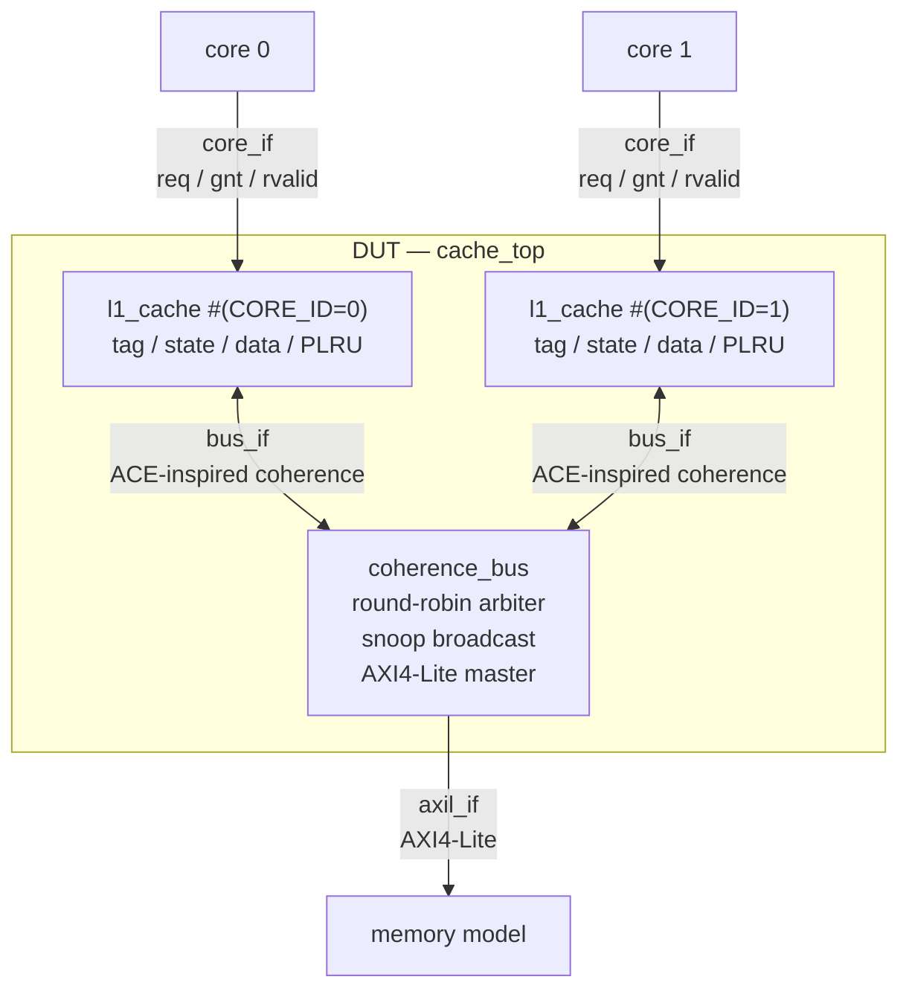
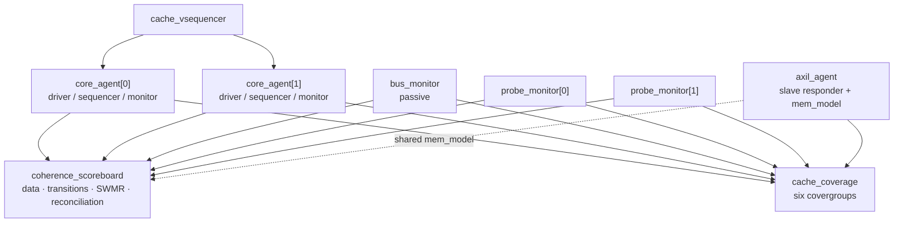

# braytcache: MESI-Coherent L1 Data Cache with UVM Verification

braytcache is a two-core, set-associative, write-back L1 data cache that maintains MESI coherence over a snooping interconnect. The RTL is verified with a constrained-random UVM environment that combines reference-model data checking, coherence-invariant checking, functional coverage, and SystemVerilog assertions.

## Project summary

- **12 / 12** functional tests passed
- **5 / 5** injected RTL bugs detected
- **2 / 2** cache geometries validated
- **98.92%** functional coverage in the best single run

| Area | Implementation |
|---|---|
| RTL | Two MESI L1 caches, a snooping interconnect, and an AXI4-Lite memory interface across 8 files |
| Verification | Four UVM agents, six covergroups, six complementary checking mechanisms, twelve tests, and three SVA modules across 29 files |
| Toolchain | Questa–Intel FPGA Starter Edition 2025.2 for compilation and elaboration; Synopsys VCS with UVM 1.2 on EDA Playground for simulation |
| Evidence | [Detailed results](#results) · [Run screenshots](docs/RUN_SCREENSHOTS.md) · [Verification findings](#verification-findings) · [Bug injection](#bug-injection) · [Debug log](docs/DEBUG_LOG.md) |

## Table of contents

- [Project motivation](#project-motivation)
- [Architecture](#architecture)
- [Design decisions](#design-decisions)
- [Cache organization](#cache-organization)
- [Coherence protocol](#coherence-protocol)
- [Interfaces](#interfaces)
- [Verification environment](#verification-environment)
- [Verification strategy](#verification-strategy)
- [Functional coverage](#functional-coverage)
- [Assertions](#assertions)
- [Stimulus and tests](#stimulus-and-tests)
- [Bug injection](#bug-injection)
- [Results](#results)
- [Verification findings](#verification-findings)
- [Running the project](#running-the-project)
- [Scope and limitations](#scope-and-limitations)
- [Future extensions](#future-extensions)
- [Repository layout](#repository-layout)

---

## Project motivation

I built this project to develop and exercise the RTL design and verification skills and concepts I learned throughout the course of my most recent internship. A coherent two-core L1 data cache was a suitable challenge because it combines independent requesters, shared state, ownership transfer, data movement, replacement, and timing-dependent behavior within a manageable scope.

The verification environment focuses on constrained-random verification, one of the most valuable methodologies I learned during my internship. My main takeaway was that effective random verification involves more than generating a large volume of traffic: the stimulus must be guided by targeted constraints, checked against independent models and invariants, and measured with functional coverage. Directed tests establish specific transitions and interleavings, while constrained-random workloads vary addresses, operation mixes, byte enables, conflicts, and memory latency. The environment compares completed transactions against a reference model, samples functional coverage, checks cache-state invariants, and applies protocol assertions throughout the run.

The result is intended as a complete design-and-verification showcase exercise rather than a performance-oriented cache. Its emphasis is on explaining the architectural choices, demonstrating that the intended behaviors were exercised, and showing how failures are detected and diagnosed.

---

## Architecture



The design has three protocol boundaries:

| Boundary | Protocol | Purpose |
|---|---|---|
| Core ↔ L1 | OBI-style `req`/`gnt`/`rvalid` | Provides a compact request, acceptance, and response interface for aligned single-word accesses |
| L1 ↔ interconnect | Simplified ACE-inspired bus | Carries shared and unique reads, ownership upgrades, writebacks, snoop responses, cache-line data, `IsShared`, and `PassDirty` |
| Interconnect ↔ memory | AXI4-Lite | Handles line fills and writebacks as `LINE_WORDS` independent single-beat transfers |

The rationale for each protocol is described in [Design decisions](#design-decisions).

---

## Design decisions

Important implementation decisions are also marked with `DECISION:` comments in the source. They can be located with:

```bash
rg -n "DECISION:" rtl verif
```

### Protocol selection

#### OBI-style core interface

The core-facing interface uses a `req`/`gnt` address phase followed by an `rvalid` response phase. This matches the needs of a blocking cache that accepts one aligned word request at a time without adding the five channels, burst handling, and transaction tracking required by AXI.

The trade-off is that the core agent is project-specific rather than reusable as a standard protocol agent.

#### ACE-inspired coherence interface

AXI4-Lite cannot represent coherence transactions because it has no snoop request, snoop response, or snoop data channels and no concept of cache-line ownership. The custom bus therefore borrows ACE terminology where it clarifies the MESI operations: `ReadShared`, `ReadUnique`, `CleanUnique`, `WriteBack`, `IsShared`, and `PassDirty`.

The implementation uses one atomic shared bus rather than ACE's independent channels, ordering rules, barriers, and distributed virtual memory operations. It is **ACE-inspired, not ACE-compliant**. A standards-compliant interface is discussed under [Future extensions](#standards-compliant-interfaces).

#### AXI4-Lite memory interface

The memory boundary carries ordinary reads and writes without coherence metadata, making AXI4-Lite a natural fit. Its independent channels also allow the memory agent to apply randomized latency and backpressure.

AXI4-Lite does not support bursts, so each line fill or writeback is divided into `LINE_WORDS` single-beat transactions. Full AXI4 burst support is discussed under [Future extensions](#standards-compliant-interfaces).

### Microarchitecture

#### Atomic transactions eliminate transient MESI states

The interconnect grants one requester at a time and holds that grant through snooping, any required memory access, and the response. The requester is excluded from its own snoop broadcast and cannot itself be snooped while it owns the grant. Each line can therefore remain in one of the four stable MESI states at every clock edge.

A split-transaction bus would introduce intervals in which a request is waiting for ownership, data, or completion. Those intervals require transient states such as `IM_AD` and `SM_AD`, as described under [Future extensions](#split-transaction-coherence-and-transient-mesi-states).

#### The cache is blocking

Each cache permits one outstanding request. This avoids MSHRs, hit-under-miss behavior, and memory-level parallelism, keeping the implementation focused on coherence correctness. It also makes completion ordering tractable for the reference model.

The trade-off is that the design is not intended to demonstrate cache performance.

#### Invalid ways are preferred over PLRU victims

Allocation uses an invalid way before consulting the tree-PLRU state. If more than one invalid way is available, the lowest index is selected to keep replacement deterministic across seeds. Once all ways are valid, the PLRU-selected way is used.

`cg_alloc` covers free-way allocation and replacement separately so that both paths must be exercised.

#### Bus operations are re-derived while waiting for arbitration

A cache can request the bus and then be snooped before it receives a grant. The RTL derives `bus.op` from the current state on every cycle instead of permanently latching the original operation. A pending `CleanUnique` can therefore become `ReadUnique` after invalidation, while a pending `WriteBack` can be withdrawn if its victim is downgraded.

This behavior is exercised by [`upgrade_race_test`](#directed-tests).

#### Clean eviction is silent

Dropping a line in `S` or `E` without notifying another cache is legal MESI behavior. Another cache may consequently remain in `S` even after it becomes the only holder. The reference model therefore treats `S` as conservative rather than as a precise count of sharers.

### Configuration and parameterization

`NUM_CORES`, `NUM_SETS`, `NUM_WAYS`, and `LINE_BYTES` are compile-time configuration values for three reasons:

1. Multiple geometries expose assumptions that were accidentally hard-coded into the RTL or verification environment.
2. A 2-way tree-PLRU uses one bit and is equivalent to LRU, while a 4-way configuration exercises the full two-level, three-bit tree.
3. The small default cache creates frequent misses, evictions, and writebacks over the 4 KB stimulus region, improving verification throughput.

The default 2-way/16-set geometry and a 4-way/8-set geometry have both been exercised. Under the recorded `eviction_test` runs, increasing associativity reduced writebacks from 14 to 3.

The geometry is controlled by compile-time defines because address types and helper functions are declared in [`cache_pkg.sv`](rtl/cache_pkg.sv), and SystemVerilog packages cannot be parameterized. Changing geometry therefore requires recompilation and is treated as a regression configuration rather than a per-run random variable.

### Verification architecture

#### White-box state observability

Single-writer/multiple-reader correctness is a state invariant, not merely a transaction property. A black-box checker may not detect an ownership violation until it eventually causes a wrong load. The testbench therefore exposes the internal tags, states, and line data through [`cache_probe_if.sv`](rtl/cache_probe_if.sv), allowing violations to be reported near their source.

The trade-off is a dependency on selected RTL hierarchy and signal names. That dependency is localized to [`tb_top.sv`](verif/tb/tb_top.sv).

#### Hierarchical probe connections

The probe interface is connected with hierarchical assignments for predictable behavior across the target simulators. SVA modules still use `bind`, where the mechanism is well supported and naturally separates assertions from the RTL.

#### Deterministic initial memory

`mem_model::backing_value()` derives an initial value from the word address. The AXI4-Lite memory model and scoreboard use the same function, so a load from an unwritten address has a deterministic expected result without pre-initializing the complete memory.

#### Testbench-reported coverage

The target flow does not provide a persistent coverage database. [`cache_coverage.sv`](verif/env/cache_coverage.sv) therefore reports each covergroup with `get_inst_coverage()` during `final_phase`.

Coverage is reported per simulation and is not merged across tests. The reported 98.92% is the best individual run, not a regression-wide union.

#### Illegal behavior is checked with `illegal_bins`

Forbidden local transitions and invalid two-cache MESI combinations are encoded as `illegal_bins`. Hitting one reports the specific violation immediately instead of treating it as an uncovered scenario.

#### Compile-time bug injection

Five small RTL mutations are controlled by `+define+BUG_n`. Each is expected to make the relevant test fail, providing evidence that the verification environment can detect the targeted defect class. See [Bug injection](#bug-injection).

---

## Cache organization

| Parameter | Default | Override |
|---|---:|---|
| `NUM_CORES` | 2 | `+define+CFG_NUM_CORES=n` |
| `NUM_SETS` | 16 | `+define+CFG_NUM_SETS=n` |
| `NUM_WAYS` | 2 | `+define+CFG_NUM_WAYS=n` |
| `LINE_BYTES` | 16 (4 words) | `+define+CFG_LINE_BYTES=n` |

The default capacity is 512 bytes per cache. `NUM_WAYS` must be a power of two.

- **Policy:** write-back, write-allocate, blocking
- **Replacement:** parameterized tree-PLRU using `NUM_WAYS-1` bits per set
- **Outstanding requests:** one per cache

### Control flow

```text
IDLE ── req & gnt ──► LOOKUP ──┬── load hit                    ──► RESP
                               ├── store hit in M or E         ──► RESP
                               ├── store hit in S              ──► BUS (CleanUnique)
                               └── miss ──► optional WB ──► BUS ──► RESP
```

The writeback state issues `WriteBack` only if the selected victim is still in `M`. Because a waiting cache can be snooped before receiving a bus grant, the victim state is re-evaluated and an unnecessary writeback can be withdrawn.

---

## Coherence protocol

### Local requests

| Current state | Load | Store |
|---|---|---|
| `I` | `ReadShared` → `S` if `IsShared`, otherwise `E` | `ReadUnique` → `M` |
| `S` | Hit; remains `S` | `CleanUnique` → `M` |
| `E` | Hit; remains `E` | Silent `E→M` |
| `M` | Hit; remains `M` | Hit; remains `M` |

### Snoop responses

| Current state | `ReadShared` | `ReadUnique` | `CleanUnique` |
|---|---|---|---|
| `I` | Miss | Miss | Miss |
| `S` | Hit; assert `IsShared`; remain `S` | Hit; transition to `I` | Hit; transition to `I` |
| `E` | Hit; assert `IsShared`; transition to `S` | Hit; transition to `I` | Unreachable under SWMR |
| `M` | Hit; assert `IsShared` and `PassDirty`; transition to `S` | Hit; assert `PassDirty`; transition to `I` | Unreachable under SWMR |

A cache issues `CleanUnique` only when it already holds the line in `S`. Under the SWMR invariant, no other cache can then hold the same line in `E` or `M`.

### Eviction

| Victim state | Action |
|---|---|
| `I` | Use the free way without bus traffic |
| `S` or `E` | Drop the clean line silently |
| `M` | Write the dirty line back to memory before replacement |

### Dirty-data ownership

Only a cache in `M` may contain data newer than memory. When another cache requests a modified line, responsibility for the current data must be preserved:

- **`ReadShared` hits `M`:** the snooper supplies the line, the interconnect writes it back to memory, and both caches finish in `S`.
- **`ReadUnique` hits `M`:** the snooper supplies the line and becomes `I`; the requester becomes `M`. Memory can remain stale because the new `M` holder owns the current copy.

MOESI avoids the first writeback by adding the `O` state, allowing dirty data to remain shared under one designated owner. MESI has no equivalent state, so a modified line must become clean when it becomes shared.

### Why the bus is atomic

On a split-transaction bus, a cache can wait between issuing a request and receiving ownership or data. It then needs a transient state describing the operation in progress and must respond correctly to snoops during that interval.

This design instead holds each bus grant until the coherence transaction completes. The requesting cache is not snooped during its granted transaction, allowing the implementation to use only the stable `I`, `S`, `E`, and `M` states. This is an intentional scope decision; transient states are the primary architectural item under [Future extensions](#split-transaction-coherence-and-transient-mesi-states).

### The arbitration race

Atomic execution does not prevent a cache from being snooped while it is waiting for a grant:

> Cache 0 holds line X in `S` and requests `CleanUnique`. Cache 1 wins arbitration first and issues `ReadUnique` for X, invalidating cache 0. Cache 0's pending upgrade is now stale because it no longer holds the line.

The RTL resolves this race by deriving `bus.op` from the current state every cycle. Cache 0's pending operation becomes `ReadUnique`, allowing it to reacquire both the line and write permission. A request may consequently retire or change before it is granted; `a_bus_progress` checks that it does not remain stuck.

In the recorded `upgrade_race_test`, six rounds produced:

```text
ReadShared=12  ReadUnique=6  CleanUnique=6  WriteBack=0
state transitions=42
```

Each round produced one successful `CleanUnique` and one degraded `ReadUnique`. The transition count also matched the expected seven transitions per round:

```text
I→E, E→S, I→S, S→M, S→I, M→I, I→M
7 transitions × 6 rounds = 42
```

---

## Interfaces

| File | Interface | Purpose |
|---|---|---|
| [`rtl/core_if.sv`](rtl/core_if.sv) | `core_if` | OBI-style core request and response interface with driver and monitor clocking blocks |
| [`rtl/bus_if.sv`](rtl/bus_if.sv) | `bus_if` | Per-master unpacked signal arrays for coherence requests, snoops, data, and responses |
| [`rtl/axil_if.sv`](rtl/axil_if.sv) | `axil_if` | Five-channel AXI4-Lite memory interface |
| [`rtl/cache_probe_if.sv`](rtl/cache_probe_if.sv) | `cache_probe_if` | White-box view of cache tags, states, and line data |

---

## Verification environment



| Component | Role |
|---|---|
| [`core_agent`](verif/agents/core_agent/core_agent.sv) | Active OBI-style master, one per core; its monitor publishes completed requests |
| [`axil_agent`](verif/agents/axil_agent/axil_agent.sv) | Active AXI4-Lite slave backed by [`mem_model`](verif/agents/axil_agent/mem_model.sv), with randomized channel latency |
| [`bus_monitor`](verif/agents/bus_agent/bus_monitor.sv) | Passive reconstruction of coherence operations, requesters, snoop results, attributes, and line data |
| [`probe_monitor`](verif/agents/probe_agent/probe_monitor.sv) | White-box stream of cache-line state and tag changes |
| [`coherence_scoreboard`](verif/env/coherence_scoreboard.sv) | Reference data, transition legality, SWMR, sharer agreement, bus checks, and final reconciliation |
| [`cache_coverage`](verif/env/cache_coverage.sv) | Independent coverage subscriber for core, bus, state, sharing, allocation, and AXI4-Lite activity |

---

## Verification strategy

The environment uses six complementary checking mechanisms.

### 1. Golden-memory data checking

Each completed store updates a byte-accurate reference memory, and each completed load is compared with the expected word. Transactions are applied in monitor completion order. Same-address operations are serialized by coherence ownership, making that order well defined for the implemented blocking system.

### 2. MESI transition legality

Every probe event is checked against a legal-transition table. A tag change is treated as an allocation and is legal only if the previous line was not modified. This detects dirty data being discarded during replacement.

### 3. SWMR invariant

For each line, the scoreboard enforces:

- At most one cache may hold `M` or `E`.
- An `M` or `E` holder may not coexist with an `S` holder.

The check scans the white-box cache state after probe events, because SWMR cannot be established from core transactions alone.

### 4. Sharer data agreement

All caches holding the same line in `S` must contain identical line data. This detects corruption that preserves a legal ownership pattern but leaves sharers with different values.

### 5. Bus-level consistency

The scoreboard checks the interconnect independently of cache state:

- `IsShared` must match the observed snoop hits on `ReadShared`.
- `CleanUnique` must not transfer dirty data.

### 6. End-of-test memory reconciliation

Every word touched during the run is reconciled with the final system state. If a cache still holds the line in `M`, that cached value is authoritative; otherwise, the backing-memory value must match the golden memory. This is the final check for dirty data that disappears without being read back.

---

## Functional coverage

| Covergroup | Coverage model |
|---|---|
| `cg_core` | Operation, core, set, word offset, and byte-enable categories; operation crosses full-word and single-byte masks |
| `cg_bus` | Coherence operation × requester × snoop hit × `PassDirty` × `IsShared` |
| `cg_mesi` | Old state × new state × tag change × core |
| `cg_share` | Cache 0 state × cache 1 state for the same line |
| `cg_alloc` | Previous occupant state × selected way × set × core |
| `cg_axil` | Read/write direction × word position within a cache line |

### Illegal and unreachable bins

`cg_mesi` rejects illegal local behavior, including `S→E`, `M→E`, and replacement of a modified line without a writeback. `cg_share` enumerates the eight two-cache state pairs forbidden by SWMR:

| | Cache 1: `I` | Cache 1: `S` | Cache 1: `E` | Cache 1: `M` |
|---|---|---|---|---|
| **Cache 0: `I`** | Legal | Legal | Legal | Legal |
| **Cache 0: `S`** | Legal | Legal | Illegal `se` | Illegal `sm` |
| **Cache 0: `E`** | Legal | Illegal `es` | Illegal `ee` | Illegal `em` |
| **Cache 0: `M`** | Legal | Illegal `ms` | Illegal `me` | Illegal `mm` |

The cross contains 16 ordered pairs: eight legal and eight illegal. `se` and `es`, for example, identify the same physical violation with opposite cache roles.

Unreachable samples—such as unchanged state/tag pairs and allocations that install an invalid line—are excluded with `ignore_bins`. `cg_share` is instantiated only when `NUM_CORES == 2`.

### Coverage reporting

[`cache_coverage.sv`](verif/env/cache_coverage.sv) prints a summary in `final_phase`:

```text
cg_core    ..... %
cg_bus     ..... %
cg_mesi    ..... %
cg_alloc   ..... %
cg_axil    ..... %
cg_share   ..... %
OVERALL    ..... %
```

Each run starts with new covergroup instances and writes no coverage database. Coverage therefore does not accumulate across tests. A suite-wide result requires simulator database collection and merging.

One coverage-model limitation remains open: `cp_be.partial` is declared as a `default` bin, which does not participate in `x_op_be`. Partial masks are counted by the coverpoint but are not crossed with the operation. Correcting this requires explicit partial-mask bins and a rerun of the recorded coverage results; see [`DEBUG_LOG.md`](docs/DEBUG_LOG.md#o-011--default-byte-enable-bin-is-absent-from-the-cross).

---

## Assertions

Three SVA modules check interface and protocol behavior independently of the UVM scoreboard and coverage model.

| File | Scope | Representative properties |
|---|---|---|
| [`verif/sva/cache_sva.sv`](verif/sva/cache_sva.sv) | Bound into every `l1_cache` | Request and payload stability, address alignment, nonzero byte enables, one outstanding request, response qualification, snoop qualification, `a_grant_excludes_snoop`, `a_op_frozen_while_granted`, and `a_bus_progress` |
| [`verif/sva/bus_sva.sv`](verif/sva/bus_sva.sv) | Coherence interconnect | One-hot-or-zero grants and responses, grant stability, response qualification, snoop targeting, and `a_single_pass_dirty` |
| [`verif/sva/axil_sva.sv`](verif/sva/axil_sva.sv) | AXI4-Lite interface | Channel stability, `OKAY` responses, aligned addresses, and response-with-request ordering |

The assertion modules are attached with `bind`, keeping verification properties outside the synthesizable RTL.

---

## Stimulus and tests

The environment contains eleven virtual sequences: eight constrained-random or randomized composite workloads and three directed scenarios.

### Core-level sequences

Core-level sequences are defined in [`verif/agents/core_agent/core_seq_lib.sv`](verif/agents/core_agent/core_seq_lib.sv).

| Sequence | Purpose |
|---|---|
| `core_base_seq` | Random operations over a configurable region with a configurable `store_pct` |
| `core_line_seq` | Accesses restricted to one line for false-sharing traffic |
| `core_pingpong_seq` | Accesses restricted to one word |
| `core_set_conflict_seq` | More live tags than ways in one set, forcing replacement |
| `core_store_streak_seq` | Repeated stores to one address, producing bus-silent `M` hits |
| `core_read_only_seq` | Load-only traffic that settles into `S` and `E` states |
| `core_single_seq` | One explicit operation for directed scenarios |

### Virtual sequences

Virtual sequences are defined in [`verif/env/seq_lib/cache_vseq_lib.sv`](verif/env/seq_lib/cache_vseq_lib.sv). The base class starts one core-level sequence per core. Constrained subclasses override `run_core_seq()`, while directed and composite sequences override `body()` to control their own scheduling.

| Virtual sequence | Targeted behavior |
|---|---|
| `random_vseq` | General constrained-random traffic |
| `shared_region_vseq` | Both cores restricted to four lines, increasing coherence activity |
| `false_sharing_vseq` | Different words in one line, stressing whole-line transfer and invalidation |
| `pingpong_vseq` | Repeated access to one word, causing frequent ownership migration |
| `eviction_vseq` | Conflicting tags in one set, forcing evictions and writebacks |
| `read_mostly_vseq` | Load-only traffic across eight lines, producing stable sharing |
| `store_streak_vseq` | Bursts of stores to one address, stressing bus-silent `M` hits and later migration |
| `producer_consumer_vseq` | Directed message-passing litmus test |
| `mesi_walk_vseq` | Directed traversal of every legal same-line MESI transition |
| `upgrade_race_vseq` | Concurrent stores from `S`, exercising `CleanUnique→ReadUnique` degradation |
| `mixed_vseq` | Three to six randomized phases executed without reset |

### Message-passing litmus test

Core 0 writes payload *k* to one line and then publishes counter *k* on a second line. Core 1 polls the counter and, after observing value *k*, requires the payload to contain message *k* **or a newer message**. The producer runs concurrently and may advance before the consumer's payload load completes, so exact equality is not required.

The test distinguishes per-line coherence from cross-line ordering. In this implementation, blocking core accesses preserve program order and the atomic bus serializes transactions, producing the expected sequentially consistent behavior. The sequence checks the ordering directly, while the golden-memory scoreboard independently checks returned data.

### Tests

The twelve tests are defined in [`verif/tests/cache_tests.sv`](verif/tests/cache_tests.sv). Each test inherits environment construction, objection handling, and drain time from `cache_base_test` and selects a virtual sequence.

#### Structural tests

**`smoke_test`** — Issues fifteen random accesses per core over the default 4 KB region. It checks basic driver, monitor, probe, scoreboard, and memory-agent integration before longer runs.

**`random_test`** — Issues 40 to 90 accesses per core with randomized load/store weighting. Its wide address distribution exercises tag/index decoding, allocation, and capacity behavior across the cache.

#### Coherence-pressure tests

**`shared_region_test`** — Restricts both cores to four lines, increasing the frequency of snoops, sharing, ownership changes, and bus contention.

**`false_sharing_test`** — Directs both cores primarily to different words within one line. Ownership transfers must preserve every word, including those not modified by the requester.

**`pingpong_test`** — Directs both cores to one word with a 40–60% store mix. This repeatedly exercises snoop lookup, invalidation, dirty intervention, ownership transfer, and arbitration.

**`eviction_test`** — Cycles both cores through more tags than the selected set can hold, with stores weighted from 50–90%. It targets replacement, dirty eviction, writeback, and final memory reconciliation.

**`read_mostly_test`** — Issues loads only over eight lines. Once both caches hold a line in `S`, later read hits should require no bus transaction. The test also checks that a requester does not install `E` while another copy exists.

**`store_streak_test`** — Runs two to four store bursts per core, moving to a new address between bursts. Repeated stores to a line in `M` should be bus-silent; the address changes reintroduce ownership acquisition and migration.

The recorded run completed 90 stores with five bus transactions. This sequence does **not** exercise `E→M`: because it issues no loads, each new line is acquired with `ReadUnique` directly into `M`. The directed MESI walk covers `E→M`.

#### Directed tests

**`mesi_walk_test`** — Performs ten accesses across three adjacent lines and traverses every legal same-line MESI transition in a known order from an empty cache. A failure can be associated with a specific transition rather than an arbitrary point in a random stream.

**`producer_consumer_test`** — Repeats the two-line message-passing scenario for four to twelve messages. The sequence checks that an observed counter never refers to a payload older than that counter.

**`upgrade_race_test`** — Repeats four to eight rounds on consecutive lines. Both cores first load a line into `S`, then launch stores concurrently. One cache completes `CleanUnique`; the other is invalidated and must re-derive its pending request as `ReadUnique`.

#### Composite test

**`regression_test`** — Runs three to six randomly selected phases without resetting between them. State left by one workload becomes the starting condition for the next, exercising phase boundaries that isolated tests do not create.

### Runtime control

`axil_agent_cfg` randomizes memory latency for every test, varying the overlap between line fills and coherence activity.

The `+num_txns=<n>` plusarg overrides the per-core sequence length for:

- `smoke_test`
- `random_test`
- `shared_region_test`
- `false_sharing_test`
- `pingpong_test`
- `eviction_test`
- `read_mostly_test`

For example, `+num_txns=30` produces 60 core accesses in a two-core configuration. The other tests determine their length through message counts, round counts, streak counts, or per-phase randomization.

---

## Bug injection

Five deliberate RTL mutations are controlled by `+define+BUG_n`. Every mutation run is expected to fail. A clean result means either that the selected stimulus did not activate the mutated path or that the environment could not observe its effect.

### Mutation results

| Define | Injected defect | Primary detector | First detection | Exit code | Evidence |
|---|---|---|---:|---:|---|
| `BUG_1` | Incorrect `M→E` transition after `ReadShared` | `cg_mesi.m_to_e` | 1.46 µs | 1 | [View](docs/screenshots/bug_1.png) |
| `BUG_2` | Sharer remains valid after `CleanUnique` | `cg_share.ms` | 7.68 µs | 1 | [View](docs/screenshots/bug_2.png) |
| `BUG_3` | Store hit ignores byte enables | Golden-memory scoreboard | 7.64 µs | 0 | [View](docs/screenshots/bug_3.png) |
| `BUG_4` | Dirty victim is replaced without writeback | `cg_mesi.dirty_dropped` | 3.67 µs | 1 | [View](docs/screenshots/bug_4.png) |
| `BUG_5` | `ReadShared` always installs `E` | `cg_share.se` | 1.80 µs | 1 | [View](docs/screenshots/bug_5.png) |

The four illegal-bin failures terminate immediately. `BUG_3` instead reaches `$finish` and reports eleven scoreboard errors, which explains its zero process exit code.

### Running a mutation

Add the selected define to **Compile Options** on EDA Playground and run `eviction_test`:

| Compile options | Run options |
|---|---|
| `+define+BUG_n` | `+UVM_TESTNAME=eviction_test +num_txns=30` |

`eviction_test` is the common workload because the recorded run exercises every mutated path, including the capacity writeback required by `BUG_4`. Other workloads can detect individual mutations, but only if they execute the affected operation.

### `BUG_1` — incorrect downgrade after `ReadShared`

```systemverilog
BUS_READ_SHARED: state_q[sn_idx][sn_way] <= MESI_E; // should be MESI_S
```

- **Effect:** A snooped cache claims exclusivity after another cache receives a copy.
- **Activation:** `ReadShared` must hit a line held by the snooped cache.
- **Detection:** `cg_mesi.m_to_e` fired at 1.455 µs with `old=M`, `new=E`, and no tag change.

### `BUG_2` — sharer retained after `CleanUnique`

```systemverilog
BUS_CLEAN_UNIQUE:
  state_q[sn_idx][sn_way] <= state_q[sn_idx][sn_way]; // should be MESI_I
```

- **Effect:** The requester enters `M` while the other cache remains in `S`, violating SWMR and leaving a stale shared copy.
- **Activation:** Both caches must hold the line in `S`, followed by a store from one cache.
- **Detection:** `cg_share.ms` fired at 7.675 µs. The local transition checker could not see the defect because the snooped cache did not change state; detection required sampling both caches.

### `BUG_3` — byte enables ignored on a store hit

```systemverilog
data_q[rq_idx][hit_way] <=
  line_set_word(..., rq_wdata_q, '1); // should use rq_be_q
```

- **Effect:** A partial store overwrites bytes outside its enable mask while all protocol behavior remains legal.
- **Activation:** A partial store must be followed by a load or final-memory reconciliation.
- **Detection:** The scoreboard reported five load mismatches and six final-memory mismatches. Coverage, bus counts, and transition counts matched the clean run.

Four final mismatches occurred at addresses that were never loaded again, demonstrating the value of end-of-test reconciliation. This mutation also shows that functional coverage is not a correctness check: protocol activity can remain identical while the data is wrong.

### `BUG_4` — dirty victim replaced without writeback

```systemverilog
assign wb_needed = 1'b0;
// should be (state_q[rq_idx][vic_q] == MESI_M)
```

- **Effect:** A modified line is destroyed when its way is reused.
- **Activation:** A line in `M` must be selected for capacity eviction.
- **Detection:** `cg_mesi.dirty_dropped` fired at 3.665 µs with `old=M` and a tag change.

`cg_alloc` and final reconciliation could also observe this defect, but the `cg_mesi` illegal bin is sampled first and terminates the run. They are potential secondary detectors, not independently demonstrated detections in this result.

### `BUG_5` — shared line incorrectly installed in `E`

```systemverilog
BUS_READ_SHARED: fill_state = MESI_E;
// should be bus.rsp_shared ? MESI_S : MESI_E
```

- **Effect:** The requester ignores `IsShared` and claims exclusivity while another cache still holds the line.
- **Activation:** `ReadShared` must hit a copy in another cache.
- **Detection:** `cg_share.se` fired at 1.795 µs. The requester's local `I→E` transition and the interconnect response are legal in isolation, so the violation is visible only in the combined cache state.

### What the mutations demonstrate

- `cg_mesi` detects illegal local transitions and dirty-line replacement.
- `cg_share` detects illegal ownership combinations across caches.
- The golden-memory scoreboard detects data corruption even when control behavior is unchanged.

No one mechanism detects every mutation. Illegal bins provide early and specific failures, while the scoreboard catches data-path errors and values that were never read back.

---

## Results

All twelve recorded functional tests passed. The design also passed with both tested geometries, and all five injected bugs were detected.

### Validation summary

| Validation | Result |
|---|---:|
| Functional tests | 12 / 12 passed |
| Cache geometries | 2 / 2 passed |
| Injected bugs | 5 / 5 detected |
| Questa compilation | 0 errors, 0 warnings |
| Questa elaboration | 0 errors |
| VCS compilation and elaboration | 0 errors |

Each listed functional result represents one recorded seed; this is targeted validation, not a multi-seed regression.

### Functional test results

| Test | Configuration or observation | Evidence |
|---|---|---|
| `smoke_test` | No UVM errors or assertion failures | [View](docs/screenshots/smoke_test.png) |
| `mesi_walk_test` | Completed the directed MESI transition walk | [View](docs/screenshots/mesi_walk_test.png) |
| `pingpong_test` | 60 accesses to one word; 71 ownership migrations | [View](docs/screenshots/pingpong_test.png) |
| `eviction_test` | 60 accesses to one set; 14 writebacks; memory reconciled | [View](docs/screenshots/eviction_test.png) |
| `eviction_test` | 4-way/8-set geometry; no source changes | [View](docs/screenshots/eviction_test_4way_8set.png) |
| `upgrade_race_test` | Six of six rounds exercised request degradation | [View](docs/screenshots/upgrade_race_test.png) |
| `producer_consumer_test` | Preserved two-line message ordering | [View](docs/screenshots/producer_consumer_test.png) |
| `false_sharing_test` | Preserved all four words across 27 ownership transfers | [View](docs/screenshots/false_sharing_test.png) |
| `store_streak_test` | 90 stores with five bus transactions | [View](docs/screenshots/store_streak_test.png) |
| `read_mostly_test` | 60 loads with no ownership upgrades | [View](docs/screenshots/read_mostly_test.png) |
| `shared_region_test` | `cg_share` reached 100% | [View](docs/screenshots/shared_region_test.png) |
| `random_test` | 130 accesses over 4 KB; `cg_alloc` reached 100%; 95.80% overall | [View](docs/screenshots/random_test.png) |
| `regression_test` | 269 accesses over three to six phases; 98.92% overall | [View](docs/screenshots/regression_test.png) |

The geometry validation consists of the default 2-way/16-set configuration and a 4-way/8-set configuration.

### Coverage results

The following values come from the best single run, `regression_test`. They are not merged across the suite.

| Covergroup | Coverage |
|---|---:|
| `cg_core` | 99.11% |
| `cg_bus` | 98.61% |
| `cg_mesi` | 96.84% |
| `cg_share` | 100.00% |
| `cg_alloc` | 98.96% |
| `cg_axil` | 100.00% |
| **Overall** | **98.92%** |

---

## Verification findings

### Notable observations

| Run | Observation |
|---|---|
| `smoke_test` | Exposed D-003: `snoop_ack` asserted for one cycle while the cache was not selected |
| `mesi_walk_test` | Exposed D-004: free-way allocations could be missed when `cg_alloc` sampled only tag changes |
| `producer_consumer_test` | Exposed D-005: the original checker required exact payload equality even though the concurrent producer could advance |
| `upgrade_race_test` | Produced the expected 42 transitions: seven per round across six rounds |
| `read_mostly_test` | Produced the expected 24 transitions: three per line across eight lines |
| 4-way `eviction_test` | Reduced writebacks from 14 to 3 compared with the 2-way run |
| `BUG_3` | Produced eleven data errors with coverage identical to the clean run |

The complete investigations are recorded in [`docs/DEBUG_LOG.md`](docs/DEBUG_LOG.md).

### Coverage depends on workload shape

| Covergroup | Best recorded run | Reason |
|---|---|---|
| `cg_core` | `regression_test` — 99.11% | Broadest combination of operations, addresses, and byte enables |
| `cg_bus` | `regression_test` — 98.61% | Multiple traffic phases produce all bus operations |
| `cg_mesi` | `eviction_test` — 98.95% | Capacity pressure creates additional state transitions |
| `cg_share` | 100% — `eviction_test`, `shared_region_test`, and `regression_test` | Repeated same-line interaction between caches |
| `cg_alloc` | 100% — `random_test` | Allocations distributed across all 16 sets |
| `cg_axil` | 100% — multiple runs | Line transfers quickly exercise every word position in both directions |

Tests restricted to one set reach only 42–50% of `cg_alloc`, while wide random traffic closes it. Conversely, `random_test` recorded no `CleanUnique` transactions despite reaching 95.80% overall coverage. Aggregate coverage therefore cannot show whether every important operation occurred.

Coverage percentages also cannot be compared directly across geometries. A 4-way cache introduces more way-related bins while generating fewer evictions, giving the run more bins and fewer allocation events with which to fill them.

### Workload intensity

| Workload | Bus operations per 100 core accesses |
|---|---:|
| `store_streak_test` | 5.6 |
| `read_mostly_test` | 27 |
| `false_sharing_test` | 45 |
| `regression_test` | 55 |
| `pingpong_test` | 60 |
| `eviction_test` | 87 |
| `random_test` | 103 |

`store_streak_test` is nearly bus-silent because repeated `M` hits require no coherence operation. `random_test` can exceed one bus operation per access because a miss may also require a victim writeback. The range demonstrates that the suite contains materially different workloads.

### Main conclusions

- **Coverage and correctness are separate measurements.** `BUG_3` left the coverage report unchanged while corrupting eleven values.
- **Traffic counters establish reachability.** A passing run cannot test `E→M` if it reports no `ReadShared`, and it cannot test an upgrade path if it reports no `CleanUnique`.
- **Expected counts provide stronger evidence than pass/fail alone.** The transition counts from `upgrade_race_test` and `read_mostly_test` matched their hand-derived values.
- **Detection latency depends on activation.** Frequently executed mutated paths were generally detected earlier than the `CleanUnique` mutation, whose path appeared only twice in the clean run.

---

## Running the project

Complete setup and reproduction instructions are available in [`docs/SETUP.md`](docs/SETUP.md).

### Toolchain

| Tool | Role |
|---|---|
| Questa–Intel FPGA Starter Edition 2025.2 | Local compilation and elaboration |
| Synopsys VCS on EDA Playground | UVM 1.2 simulation |

The free Questa edition compiles and elaborates the complete project, but its license cannot load simulations using the required verification and coverage features. The reported simulations were therefore run with VCS on EDA Playground.

### Workflow

```text
Edit rtl/ or verif/
    ↓
Compile and elaborate locally with Questa
    ↓
Generate the EDA Playground bundles
    ↓
Paste the updated bundle and run with VCS
```

### Compile and elaborate locally

Run from the Questa transcript:

```tcl
cd {<repo>/braytcache/sim}
vlib work
vlog -sv -mfcu +acc=rn -timescale 1ns/1ps -f braytcache.f
vopt +acc=rn -L mtiUvm tb_top -o tb_opt
```

The file list in [`sim/braytcache.f`](sim/braytcache.f) defines the complete compilation order.

### Generate the EDA Playground source files

EDA Playground provides one Design pane and one Testbench pane. The bundling script combines the repository into the two self-contained files expected by that interface.

From the repository root, run:

```bash
python sim/bundle_playground.py
```

The script generates:

| Generated file | Contents | Playground pane |
|---|---|---|
| `playground/design.sv` | RTL, interfaces, and SVA modules | **Design** |
| `playground/testbench.sv` | UVM package and `tb_top` | **Testbench** |

The script expands the SystemVerilog `` `include `` directives and preserves the required compilation order. Edit the original files, not the generated bundles, and rerun the script after each source change.

| Changed source | Pane to update |
|---|---|
| `rtl/` or `verif/sva/` | **Design** |
| `verif/agents/`, `verif/env/`, `verif/tests/`, or `verif/tb/` | **Testbench** |

Both bundles are regenerated every time, but only the affected pane normally needs to be pasted again.

### Run on EDA Playground

Sign in to [EDA Playground](https://edaplayground.com) and use:

| Setting | Value |
|---|---|
| Testbench + Design | `SystemVerilog/Verilog` |
| UVM / OVM | `UVM 1.2` |
| Tools & Simulators | `Synopsys VCS` |
| Run Options | `+UVM_TESTNAME=smoke_test +num_txns=5` |

Paste `playground/design.sv` into **Design** and `playground/testbench.sv` into **Testbench**, then select **Run**. No compile option is required for the default geometry.

Playground compiler messages refer to line numbers in the generated bundles rather than the original source files.

### Compile and run options

| Field | Purpose | Example |
|---|---|---|
| Compile Options | Preprocessor definitions and compiler switches | `+define+BUG_2` |
| Run Options | Test selection and runtime plusargs | `+UVM_TESTNAME=eviction_test +num_txns=30` |

Useful debug options are:

```text
+UVM_VERBOSITY=UVM_HIGH
+dump
```

Enable **Open EPWave after run** when using `+dump`.

### Tool capability checks

- [`sim/tool_check.sv`](sim/tool_check.sv) exercises classes, constraints, covergroups, illegal cross bins, and concurrent assertions.
- [`sim/tool_check_uvm.sv`](sim/tool_check_uvm.sv) verifies that the UVM library is available and linked.

[`sim/Makefile`](sim/Makefile) documents the intended fully licensed local flow, including multi-seed regression and coverage merge targets. It was not used to produce the reported results.

---

## Scope and limitations

### Coherence model

- **Atomic snooping bus:** Granted operations complete before the next transaction; there are no transient MESI states.
- **Two validated cores:** The interconnect is parameterized, but the current sharing covergroup assumes exactly two cores.
- **No directory:** Broadcast snooping is appropriate for a small system but does not scale to large core counts.
- **Sequentially consistent behavior:** Ordering follows from blocking core accesses and atomic bus transactions rather than a separate memory-ordering mechanism.

### Cache microarchitecture

- One outstanding request per cache
- No MSHRs, hit-under-miss support, or memory-level parallelism
- Data cache only; no instruction cache, TLB, or virtual addressing
- No write buffer, victim cache, or prefetcher

### Unsupported operations

- Cache maintenance operations
- Memory barriers
- Atomic operations or load-reserved/store-conditional
- Mid-test reset

Reset is asserted at the beginning of simulation, and the verification components assume it remains deasserted during active traffic.

### Memory interface

AXI4-Lite does not support bursts. Each line fill or writeback is split into `LINE_WORDS` independent single-beat transactions.

---

## Future extensions

### Split-transaction coherence and transient MESI states

The most valuable architectural extension would be to introduce transient MESI states. Replacing the atomic bus with separate request, snoop, data-transfer, and response phases would allow multiple coherence operations to be in progress.

This would require:

- Transient states such as `IM_AD` and `SM_AD` for operations waiting on ownership, data, or completion
- Snoop behavior for every stable and transient state
- Tracking for competing ownership requests and delayed responses
- Verification of response ordering, data forwarding, invalidation races, and conflicting in-flight transactions

This change would remove the largest simplifying assumption in the current coherence design and would affect both the RTL and UVM architecture.

### Standards-compliant interfaces

- **Full ACE coherence:** Replace the ACE-inspired shared bus with AC, CR, and CD channels; the complete transaction set, including `ReadOnce`, `ReadNotSharedDirty`, `CleanShared`, `WriteBack`, `WriteClean`, and `Evict`; and support for barriers and distributed virtual memory operations. A commercial ACE VIP could then provide independent protocol checking.

- **AXI4 bursts:** Replace the AXI4-Lite memory interface with full AXI4 so each line transfer can use an incrementing burst with `ARLEN`/`AWLEN` and `RLAST`/`WLAST`. Multiple outstanding bursts would also require IDs, response tracking, and support for out-of-order completion.

### Future cache enhancements

- **Non-blocking operation with MSHRs:** Add hit-under-miss, multiple outstanding misses, and memory-level parallelism. The scoreboard would need to track completion order explicitly.
- **Additional geometries:** Exercise more combinations of ways, sets, line sizes, and cores.
- **Multilevel hierarchy:** Add an inclusive or exclusive L2 cache, back-invalidations, and a second coherence boundary.
- **More cores:** Extend the sharing checks beyond two caches and replace broadcast snooping with a directory as the system grows.
- **Performance features:** Add write buffers, a victim cache, and prefetching.

### Deeper coverage

The current architecture could support several additional coverage dimensions:

- Bus operation × requester × initiating state
- Ordered transition paths such as `I→E→M→S→I`
- Back-to-back, alternating, and starvation-window arbiter scenarios
- Assertion attempt and success coverage to identify vacuous passes
- Memory latency × observed miss penalty
- Geometry × architectural behavior

These additions require more instrumentation, cross-stream correlation, or persistent multi-run coverage management than the current flow provides.

### Verification methodology

- **Mid-test reset:** Verify recovery of caches, interconnect, agents, monitors, scoreboard state, and coverage after interrupted transactions.
- **Formal checking:** Use the small stable-state model to prove SWMR and transition properties over the reachable state space.
- **Memory-consistency litmus suite:** Extend the producer-consumer test with store buffering, independent reads of independent writes, and additional coherence litmus tests.
- **X-propagation:** Check reset, initialization, and control logic under pessimistic unknown propagation.
- **Power-aware simulation:** Add isolation, retention, and power-state behavior.

### Expanded simulation infrastructure

A full Questa, VCS, or Xcelium license would enable:

- **Merged coverage:** Combine UCDB or VDB results across tests and seeds to report suite-level coverage.
- **Automated regressions:** Exercise the existing `sim/Makefile` flow across all twelve tests and 50 or more seeds in parallel.
- **Longer runs:** Increase `+num_txns` from tens to thousands to improve the probability of rare interactions.
- **RTL code coverage:** Add line, branch, condition, toggle, and FSM coverage alongside the functional model.
- **Coverage-driven seed ranking:** Prioritize seeds that contribute new coverage.
- **Assertion coverage and scalable waveform analysis:** Record property activation and debug runs beyond EDA Playground's practical limits.

---

## Repository layout

```text
braytcache/
├── rtl/
│   ├── cache_pkg.sv          Parameters, MESI/ACE enums, and tree-PLRU helpers
│   ├── core_if.sv            OBI-style core interface
│   ├── bus_if.sv             ACE-inspired coherence interface
│   ├── axil_if.sv            AXI4-Lite memory interface
│   ├── cache_probe_if.sv     White-box cache-state probe
│   ├── l1_cache.sv           Cache FSM, arrays, and snoop handling
│   ├── coherence_bus.sv      Arbitration, snoop broadcast, and AXI4-Lite master
│   └── cache_top.sv          Two caches and the shared interconnect
├── verif/
│   ├── agents/
│   │   ├── core_agent/       Core item, configuration, driver, monitor, and sequences
│   │   ├── axil_agent/       AXI item, slave driver, monitor, and memory model
│   │   ├── bus_agent/        Passive coherence-bus monitor
│   │   └── probe_agent/      White-box state monitor
│   ├── env/
│   │   ├── seq_lib/          Virtual sequence library
│   │   └── ...               Configuration, scoreboard, coverage, and virtual sequencer
│   ├── tests/                UVM test library
│   ├── sva/                  Cache, interconnect, and AXI4-Lite assertions
│   ├── tb/tb_top.sv          Clock, reset, probe wiring, configuration, and SVA binding
│   └── cache_uvm_pkg.sv      UVM package
├── sim/
│   ├── braytcache.f          Compilation file list
│   ├── Makefile              Proposed local simulation and regression flow
│   ├── tool_check.sv         Standalone SystemVerilog capability check
│   ├── tool_check_uvm.sv     Standalone UVM capability check
│   └── bundle_playground.py  EDA Playground source bundler
├── docs/
│   ├── SETUP.md              Setup and reproduction guide
│   ├── DEBUG_LOG.md          Bring-up issues and technical observations
│   ├── RUN_SCREENSHOTS.md    Index of recorded run evidence
│   └── screenshots/          Simulation screenshots
└── README.md
```
